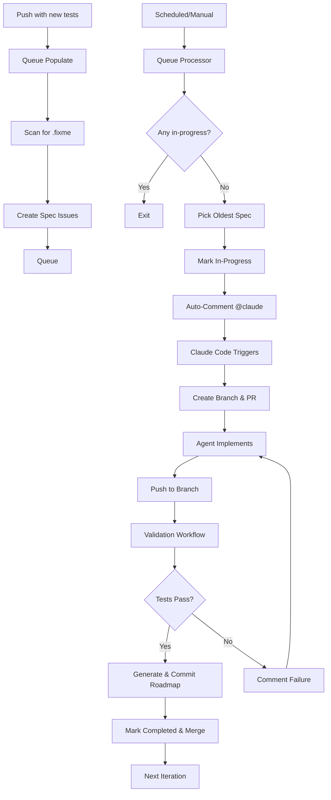

# TDD Automation Queue System Documentation

## Overview

The TDD Automation Queue System is a GitHub Actions-based pipeline that automatically implements code to make failing E2E tests pass. It uses a **queue-based architecture** where specs are processed asynchronously, one at a time, without polling or timeouts.

**Important**: The system **only processes RED tests** marked with `test.fixme()` or `it.fixme()`. Passing tests (GREEN) and skipped tests (`test.skip()`) are automatically excluded from the queue.

## Architecture



## Components

### 1. Queue Manager (`scripts/tdd-automation/queue-manager.ts`)

Core CLI tool for managing the queue:

```bash
# Scan for fixme specs and display results
bun run scripts/tdd-automation/queue-manager.ts scan

# Create issues for all fixme specs (skip duplicates)
bun run scripts/tdd-automation/queue-manager.ts populate

# Get next spec from queue (for workflows)
bun run scripts/tdd-automation/queue-manager.ts next

# Display queue status
bun run scripts/tdd-automation/queue-manager.ts status
```

**Features**:

- Extracts spec IDs from test titles (e.g., `APP-VERSION-001`)
- Checks for duplicate issues before creating
- Integrates with GitHub CLI (`gh`)
- Supports queue state management (queued, in-progress, completed, failed)

### 2. Workflows

#### **tdd-queue-populate.yml** (Scan & Queue RED Tests)

**Triggers**:

- Push to main (when new tests are added)
- Schedule (every 15 minutes)
- Manual dispatch

**Purpose**: Scans for RED tests with `test.fixme()` patterns and creates spec issues

**Important Filtering**:

- ✅ **Includes**: Tests with `test.fixme()` or `it.fixme()` (RED tests needing implementation)
- ❌ **Excludes**: Passing tests without `.fixme()` (GREEN tests already working)
- ❌ **Excludes**: Skipped tests with `test.skip()` (intentionally skipped)

**Key Steps**:

1. Scan for RED tests with `.fixme()` only
2. Check if specs need queueing
3. Create issues (skip duplicates)
4. Display queue status

#### **tdd-queue-processor.yml** (Pick & Process)

**Triggers**:

- Schedule (every 15 minutes)
- Manual dispatch

**Purpose**: Picks the next spec from the queue and prepares it for implementation

**Key Steps**:

1. Check if any spec is in-progress
2. If none, pick oldest queued spec
3. Mark issue as in-progress
4. Post @claude comment with complete workflow instructions
5. Exit (no waiting - **Claude Code creates branch and PR later**)

**Note**: The queue processor **does NOT create any branches**. Claude Code automatically creates branches with pattern `claude/issue-{ISSUE_NUMBER}-{timestamp}` when it starts working.

**Concurrency**: Strict serial - only one spec can be in-progress at a time

#### **claude-tdd.yml** (Claude Code Implementation)

**Triggers**:

- issue_comment event when @claude mentioned (posted by queue processor every 15 min)
- Manual @claude mentions by project owner
- Manual workflow_dispatch for specific issues

**Purpose**: Automatically implements specs using dual-agent workflow with retry logic

**Key Steps**:

1. **Create branch automatically** (Claude Code creates branch with pattern `claude/issue-{ISSUE_NUMBER}-{timestamp}`)
   - Example: `claude/issue-1319-20251102-2026`
   - Timestamp ensures uniqueness (no conflicts)
   - No manual `git checkout -b` needed
2. **Run @agent-e2e-test-fixer**: Remove `.fixme()`, implement minimal code
3. **Run @agent-codebase-refactor-auditor**: Review quality, refactor (ALWAYS)
4. Commit changes (Claude Code account) - includes `bun run license`
5. **ALWAYS create PR** to main with `tdd-automation` label and **include `Closes #<issue_number>` in PR body** - REQUIRED even if only `.fixme()` removal, NO EXCEPTIONS
6. **Verify PR creation**: Wait up to 2 minutes for PR to appear
   - If PR created: Continue to validation
   - If no PR after 2 minutes: Mark issue `tdd-spec:failed`, comment, exit (pipeline continues with next spec)
7. **Monitor test.yml validation** with retry loop (max 3 attempts):
   - Check test.yml CI status
   - On failure: Analyze errors, fix code, push again
   - Track retry count with labels (retry:1, retry:2, retry:3)
   - After 3 failures: Mark issue `tdd-spec:failed`, comment, exit
   - On success: Enable PR auto-merge with --squash
8. **Issue closes automatically** when PR merges to main (handled by test.yml via `Closes #` syntax)

**Retry Logic**:

- Max 3 attempts per spec
- Automatic error analysis and fixing
- Pipeline continues even if spec fails (doesn't block queue)

#### **test.yml** (PR Validation & Issue Closure)

**Triggers**:

- Pull request events (opened, synchronize, reopened, closed)
- Push to main branch

**Purpose**: Validates PRs and closes TDD issues when PRs merge

**Key Steps**:

1. **test job** (skip if PR closed):
   - Lint code (`bun run lint`)
   - Type check (`bun run typecheck`)
   - Run unit tests (`bun test:unit`)
   - Run E2E regression tests (`bun test:e2e:regression`)

2. **close-tdd-issue job** (only on PR merge):
   - Triggers when PR with `tdd-automation` label merges
   - Extracts issue number from PR body using `Closes #<number>` pattern
   - Closes issue with reason "completed"
   - Adds label `tdd-spec:completed`
   - Removes label `tdd-spec:in-progress`
   - **Note**: PR body MUST include `Closes #<issue_number>` for automatic closure

3. **verify-issue-closed job** (safeguard after PR merge):
   - Runs after `close-tdd-issue` completes (even if it fails)
   - Verifies issue is actually closed and has correct labels
   - **Critical safeguard**: Force-closes issue if closure failed
   - **Prevents queue blocking**: Without this, failed closures block the entire pipeline (like issue #1317)
   - Ensures `tdd-spec:in-progress` is removed and `tdd-spec:completed` is added
   - Returns error if force-close fails (alerts for manual intervention)

4. **delete-tdd-branch job** (cleanup unmerged branches):
   - Triggers when PR is closed **without merging** for `tdd/*` or `claude/*` branches
   - Automatically deletes the branch to prevent stale branches
   - Complements GitHub's auto-delete setting (which only handles merged PRs)
   - **Note**: Merged PR branches are auto-deleted by GitHub repository setting

#### **cleanup-stale-branches.yml** (Periodic Cleanup)

**Triggers**:

- Schedule (weekly on Sundays at 2 AM UTC)
- Manual dispatch

**Purpose**: Safety net to clean up any stale branches missed by automatic deletion

**Key Steps**:

1. Scan for all `tdd/*` and `claude/*` branches
2. Check if each branch has an open, closed, or merged PR
3. Delete branches with closed/merged PRs
4. Delete orphaned branches (>7 days old, no PR)
5. Keep branches with open PRs or recent activity

#### **tdd-queue-recovery.yml** (Timeout Recovery)

**Triggers**:

- Schedule (every 30 minutes)
- Manual dispatch

**Purpose**: Detects and recovers specs stuck in-progress with no activity

**Key Steps**:

1. Scan for specs `in-progress` > 90 minutes with no updates
2. Re-queue stuck specs (change to `queued` state)
3. Preserve retry count labels
4. Comment on issue about timeout recovery
5. **Result**: Prevents permanent pipeline blocks from stuck specs

#### **tdd-queue-stuck-pr-monitor.yml** (Auto-Merge Safeguard) ⚠️ NEW

**Triggers**:

- Schedule (every 10 minutes)
- Manual dispatch

**Purpose**: Detects PRs that are stuck in an open state despite being ready to merge, and automatically enables auto-merge

**Key Steps**:

1. Scan all open `tdd-automation` PRs
2. Identify PRs that:
   - Have all CI checks passing (SUCCESS)
   - Are mergeable (MERGEABLE state)
   - Don't have auto-merge enabled
   - Are older than 5 minutes (gives Claude Code time to enable it manually)
3. Enable auto-merge automatically: `gh pr merge --auto --squash`
4. Post comment explaining the automatic intervention
5. **Result**: Prevents pipeline from blocking when Claude Code fails to enable auto-merge

**Why This Is Needed**:

- Issue #1319: Claude created PR but didn't enable auto-merge → Pipeline blocked
- PR #1546: All checks passing, mergeable, but stuck open for 2 hours → Pipeline blocked
- PR #1541: Same issue → Manual intervention required

**Impact**: This workflow is a **critical safeguard** that prevents the most common cause of pipeline blocking.

#### **tdd-queue-conflict-resolver.yml** (Automatic Conflict Resolution) ⚠️ NEW

**Triggers**:

- Push to main branch (when main updates, existing PRs might become conflicted)
- Schedule (every 15 minutes as safety net)
- Manual dispatch

**Purpose**: Automatically resolves merge conflicts in tdd-automation PRs by triggering Claude Code to rebase the branch

**Key Steps**:

1. Scan all open `tdd-automation` PRs
2. Identify PRs with merge conflicts (CONFLICTING or DIRTY state)
3. Check if conflict resolution was already attempted (via `conflict-resolution:attempted` label)
4. If first attempt: Post @claude mention with rebase instructions:
   - Fetch latest main
   - Rebase PR branch onto main
   - Resolve conflicts (prioritize incoming changes from main)
   - Run tests to verify resolution
   - Force push rebased branch
   - Verify auto-merge is still enabled
5. If second attempt (already has label): Mark for manual review, remove from queue
6. **Result**: Automatically resolves conflicts to prevent PRs from becoming stale

**Why This Is Needed**:

- PR #1545: Became conflicted after another PR merged → Stuck in CONFLICTING state
- Long-running PRs: Can become stale when main advances
- Queue blocking: Conflicted PRs prevent pipeline from progressing

**Retry Limit**: One automatic attempt per PR (prevents infinite loops)

### 3. Configuration

All configuration is hardcoded in workflow files (no central config file):

**Key Settings**:

- **Processing interval**: 15 minutes (`.github/workflows/tdd-queue-processor.yml` cron)
- **Max concurrent**: 1 spec at a time - strict serial (hardcoded in processor logic)
- **Issue labels**: `tdd-spec:queued`, `tdd-spec:in-progress`, `tdd-spec:completed`, `tdd-spec:failed`
- **Auto-validation**: Enabled (`.github/workflows/test.yml`)
- **Auto-merge**: Enabled with squash merge (hardcoded in `claude-tdd.yml` prompt)
- **Max retries**: 3 attempts (hardcoded in `claude-tdd.yml` prompt)

## How It Works

### Step 1: Queue Population

When you push new tests with `.fixme()`:

1. **Workflow triggers**: `tdd-queue-populate.yml`
2. **Scan**: `queue-manager.ts scan` finds all specs with `.fixme()`
3. **Create issues**: One minimal issue per spec ID (e.g., `APP-VERSION-001`)
4. **Skip duplicates**: Checks if issue already exists
5. **Label**: `tdd-spec:queued` + `tdd-automation`

**Issue Format**:

```markdown
## 🤖 APP-VERSION-001: should display version badge...

**File**: `specs/app/version/version.spec.ts:28`
**Feature**: app/version/version

### For Claude Code

@claude Please implement this spec:

1. Remove `.fixme()` from test APP-VERSION-001
2. Implement minimal code to pass test
3. Commit: `fix: implement APP-VERSION-001`

Validation runs automatically on push.

**Note**: Branch is created automatically by Claude Code with pattern `claude/issue-{ISSUE_NUMBER}-{timestamp}`.
```

### Step 2: Queue Processing

Every 15 minutes (or manual):

1. **Workflow triggers**: `tdd-queue-processor.yml`
2. **Check in-progress**: Query issues with `tdd-spec:in-progress` label
3. **If any exist**: Exit (strict serial - one at a time)
4. **If none**: Pick oldest issue with `tdd-spec:queued` label
5. **Validate issue state** (⚠️ NEW - Duplicate Prevention):
   - Check if issue is still open (not closed)
   - Check for existing open PRs for this issue
   - If already closed or has open PR: Skip and post explanation comment
   - **Result**: Prevents duplicate PRs for same issue (like PR #1545 incident)
6. **Mark in-progress**: Change label to `tdd-spec:in-progress`
7. **Auto-invoke Claude**: Post comment with `@claude` mention and implementation instructions
8. **Exit**: No waiting, queue processor is done (branch and PR created by Claude Code next)

### Step 3: Automated Implementation (Claude Code)

**Fully automated** - triggered by `@claude` mention in auto-comment:

1. **Claude Code workflow triggers**: `claude-tdd.yml` detects `@claude` mention via issue_comment event
2. **Branch created automatically**: Claude Code creates branch with pattern `claude/issue-{ISSUE_NUMBER}-{timestamp}` (e.g., `claude/issue-1319-20251102-2026`)
3. **Run @agent-e2e-test-fixer**:
   - Read test file with spec ID
   - Remove `.fixme()` from specific test
   - Implement minimal code following architecture patterns
4. **Run @agent-codebase-refactor-auditor** (ALWAYS):
   - Review implementation quality
   - Check for code duplication
   - Ensure architectural compliance
   - Refactor and optimize as needed
5. **Commit changes**:
   - Run `bun run license` (add copyright headers)
   - Commit: `fix: implement APP-VERSION-001`
   - Push to branch
6. **ALWAYS create PR**: To main with `tdd-automation` label and **include `Closes #<issue_number>` in PR body** - REQUIRED in all cases (even if only `.fixme()` removal)
7. **PR verification**: Workflow verifies PR was created within 2 minutes
8. **On PR verification failure**: Mark issue `tdd-spec:failed`, exit (pipeline continues)
9. **Monitor validation**: Watch test.yml CI checks (retry up to 3 times)
10. **On success**: Enable PR auto-merge
11. **On 3 failures**: Mark issue `tdd-spec:failed`, exit

**Pipeline Mode Behavior**:

- Non-interactive (no questions to user)
- Automatic decision-making following Sovrium patterns
- Minimal implementation (just enough to pass test)
- Uses Effect.ts for side effects, proper type safety

### Step 4: PR Validation & Retry

**After PR creation**, Claude Code monitors test.yml validation:

1. **Workflow triggers**: `test.yml` on pull_request events
2. **Run validations**:
   - Lint: `bun run lint`
   - Type check: `bun run typecheck`
   - Unit tests: `bun test:unit`
   - E2E regression: `bun test:e2e:regression`
3. **Claude monitors CI status**: Checks test.yml results via GitHub API
4. **On validation failure** (retry up to 3 times):
   - Claude analyzes error logs
   - Identifies root cause
   - Fixes code
   - Commits and pushes
   - Adds retry label (retry:1, retry:2, or retry:3)
   - Waits for next test.yml run
5. **On 3rd failure**:
   - Updates issue labels: remove `tdd-spec:in-progress`, add `tdd-spec:failed`
   - Comments on issue with failure summary
   - Exits (allows pipeline to continue with next spec)
6. **On success**:
   - Enables PR auto-merge: `gh pr merge --auto --squash`
   - Exits

**Result**: Failed specs (after 3 attempts) are marked but don't block the queue.

### Step 5: PR Merge & Issue Closure

**When PR merges to main**:

1. **test.yml close-tdd-issue job triggers**
2. **Extracts issue number** from PR body using `Closes #<number>` pattern
3. **Closes issue** with reason "completed"
4. **Updates labels**:
   - Adds: `tdd-spec:completed`
   - Removes: `tdd-spec:in-progress`

**Important**: PR body MUST include `Closes #<issue_number>` for automatic closure (workflow provides this to Claude Code automatically).

**Result**: Issues only close when code actually merges to main.

### Step 6: Timeout Recovery

**Recovery workflow runs every 30 minutes**:

1. **Scan for stuck specs**: Find specs `in-progress` with no updates > 90 minutes
2. **Automatic re-queue**: Reset stuck specs to `queued` state (preserve retry count)
3. **Post recovery comment**: Notify about timeout and re-queue
4. **Queue continues**: Stuck specs don't permanently block the pipeline

### Step 7: Completion & Queue Progression

When validation passes and PR merges:

1. **Auto-merge enabled**: PR automatically merges to main (squash merge)
2. **Issue auto-closes**: test.yml workflow closes issue on PR merge
3. **Labels updated**: `tdd-spec:completed` added
4. **Queue progresses**: Processor picks next spec on next run (15 min)

**Timeline**: From queue → implementation → PR → merge typically 10-30 minutes per spec (depending on complexity and retry attempts)

## Labels & States

| Label                           | State       | Description                                      |
| ------------------------------- | ----------- | ------------------------------------------------ |
| `tdd-spec:queued`               | Queued      | Spec waiting to be processed                     |
| `tdd-spec:in-progress`          | In Progress | Spec being implemented (branch created)          |
| `tdd-spec:completed`            | Completed   | Spec passed validation (issue closed)            |
| `tdd-spec:failed`               | Failed      | Spec failed after 3 retries (needs human review) |
| `skip-automated`                | Skipped     | Human marked as too complex (queue skips it)     |
| `retry:1`, `retry:2`, `retry:3` | Retry Count | Tracks automatic retry attempts (max 3)          |
| `tdd-automation`                | (always)    | All TDD automation issues                        |

## CLI Commands

```bash
# Queue Management
bun run scripts/tdd-automation/queue-manager.ts scan       # Scan for fixme specs
bun run scripts/tdd-automation/queue-manager.ts populate   # Create issues
bun run scripts/tdd-automation/queue-manager.ts next       # Get next spec
bun run scripts/tdd-automation/queue-manager.ts status     # Show queue status

# Manual Workflow Triggers
gh workflow run tdd-queue-populate.yml                     # Populate queue
gh workflow run tdd-queue-processor.yml                    # Process next spec

# View Queue (GitHub CLI)
gh issue list --label "tdd-spec:queued"                    # Show queued specs
gh issue list --label "tdd-spec:in-progress"               # Show in-progress specs
gh issue list --label "tdd-spec:completed" --state closed  # Show completed specs
```

## Monitoring

Use `queue-manager.ts status` to view current queue status:

```bash
bun run scripts/tdd-automation/queue-manager.ts status
```

This shows:

- Number of queued specs
- Number of in-progress specs
- Top queued specs with priority levels

## Best Practices

### For Manual Triggering

```bash
# Populate queue with all specs
gh workflow run tdd-queue-populate.yml

# Wait 1 minute, then process first spec
sleep 60
gh workflow run tdd-queue-processor.yml

# Check queue status
bun run scripts/tdd-automation/queue-manager.ts status
```

### For Claude Code (Automated)

**The system is fully automated** - Claude Code agents are invoked automatically via `@claude` mentions in issue comments.

**How automation works**:

1. **Queue processor creates issue**: New spec issue with `tdd-spec:queued` label
2. **Auto-comment posted**: Issue receives comment with `@claude` mention and implementation instructions
3. **Claude Code workflow triggers**: Detects `@claude` mention, starts agent
4. **Agent operates in pipeline mode**: Creates branch automatically with pattern `claude/issue-{ISSUE_NUMBER}-{timestamp}`
5. **Agent implements test**: Removes `.fixme()`, writes minimal code, commits, pushes
6. **Validation runs**: Automatic validation on push
7. **Auto-merge enabled**: Claude Code runs `gh pr merge --auto --squash` after validation passes
8. **PR merges automatically**: When all checks pass, issue auto-closes

**Manual intervention** (only if automation fails):

If the automated system fails or needs human review:

1. **Check the issue comments**: Look for error messages from validation
2. **Manual invocation**: Reply to issue with `@claude - Please implement spec {SPEC-ID} following the instructions above`
3. **Manual implementation**: Find the Claude-created branch (`claude/issue-{ISSUE_NUMBER}-*`) or create a new one and implement manually

**Pipeline Mode Rules** (for agents):

- ✅ **DO**: Remove `.fixme()` from single spec only
- ✅ **DO**: Implement minimal code to pass test
- ✅ **DO**: Follow domain/application/infrastructure architecture
- ✅ **DO**: Use Effect.ts for side effects
- ✅ **DO**: Run `bun run license` before committing
- ✅ **DO**: Commit with format: `fix: implement {SPEC-ID}`
- ❌ **DO NOT**: Modify multiple specs at once
- ❌ **DO NOT**: Change test logic
- ❌ **DO NOT**: Skip validation steps
- ❌ **DO NOT**: Force push

### For Debugging

```bash
# Check queue status
bun run scripts/tdd-automation/queue-manager.ts status

# View recent workflow runs
gh run list --workflow=tdd-queue-processor.yml --limit 5

# View specific spec issue
gh issue view {issue-number}

# Check validation results
gh run list --workflow=tdd-validate.yml --limit 5

# View PR for spec
gh pr list --label "tdd-automation"
```

## Troubleshooting

### No specs being processed

**Check**:

1. Are there any issues with `tdd-spec:queued`?
   ```bash
   gh issue list --label "tdd-spec:queued"
   ```
2. Is there already a spec in-progress?
   ```bash
   gh issue list --label "tdd-spec:in-progress"
   ```
3. Are workflows running?
   ```bash
   gh run list --workflow=tdd-queue-processor.yml
   ```

### PR not created (spec marked as failed)

If a spec finishes successfully but no PR is created within 2 minutes:

**What happens automatically**:

1. Workflow marks issue as `tdd-spec:failed`
2. Workflow posts comment explaining PR verification failure
3. Pipeline continues with next spec (doesn't block)

**Manual intervention**:

1. Check if branch exists with changes:
   ```bash
   git fetch origin
   git log origin/claude/issue-{issue-number}-* --oneline
   ```
2. If branch has valid changes, manually create PR:

   ```bash
   gh pr create --base main --head "claude/issue-{issue-number}-{timestamp}" \
     --title "fix: implement {SPEC-ID}" \
     --body "Closes #{issue-number}" \
     --label "tdd-automation"
   ```

   **⚠️ CRITICAL - PR Body Format**:
   - GitHub's auto-close keywords are **format-sensitive**
   - ✅ **Correct**: `Closes #1234` (issue number only, no extra text)
   - ❌ **Wrong**: `Closes #1234 - description here` (extra text breaks auto-close)
   - If multiple issues: Use separate lines
     ```
     Closes #1234
     Closes #5678
     ```

3. If no valid changes, re-queue issue:
   ```bash
   gh issue edit {issue-number} --remove-label "tdd-spec:failed"
   gh issue edit {issue-number} --add-label "tdd-spec:queued"
   ```

**Root causes**:

- Claude Code determined no changes needed (test already passes)
- API rate limit or GitHub connectivity issue
- Branch push failed silently

**Prevention**: Workflow now enforces PR creation in ALL cases (even if only `.fixme()` removal).

### PR stuck open (ready to merge but not merging) ⚠️ NEW

**Most Common Cause**: Claude Code created PR but didn't enable auto-merge

**Automatic Fix** (via `tdd-queue-stuck-pr-monitor.yml`):

- Workflow runs every 10 minutes
- Detects PRs with passing CI and mergeable state but no auto-merge
- Automatically enables auto-merge after 5 minutes
- Posts comment explaining intervention

**Manual Check**:

```bash
# Check if auto-merge is enabled
gh pr view {pr-number} --json autoMergeRequest

# If null, enable it manually
gh pr merge {pr-number} --auto --squash

# Verify it was enabled
gh pr view {pr-number} --json autoMergeRequest
```

**Expected output** (if successful):

```json
{
  "enabledAt": "2025-11-03T...",
  "mergeMethod": "SQUASH"
}
```

**Root Causes**:

- Claude Code workflow incomplete (Step 4B skipped)
- GitHub API rate limit during auto-merge enablement
- PR was in UNKNOWN mergeable state temporarily

**Prevention**: Stuck PR Monitor workflow (runs every 10 min) + strengthened Claude Code instructions

### PR has merge conflicts ⚠️ NEW

**Automatic Resolution** (via `tdd-queue-conflict-resolver.yml`):

- Workflow triggers when main branch updates
- Detects conflicted PRs automatically
- Posts @claude mention with rebase instructions
- Claude Code automatically rebases and resolves conflicts
- One automatic attempt per PR (prevents infinite loops)

**Manual Resolution** (if automatic fails):

```bash
# Fetch latest main
git fetch origin main:main

# Checkout PR branch
git checkout {branch-name}

# Rebase onto main
git rebase origin/main

# Resolve conflicts (if any)
# - Prioritize incoming changes from main
# - Keep both changes in test files if possible

# Force push
git push --force-with-lease

# Verify auto-merge is still enabled
gh pr view {pr-number} --json autoMergeRequest
```

**If labeled `needs-manual-resolution`**:

- Automatic resolution already failed
- Manual intervention required
- Issue removed from queue to unblock pipeline

### Spec stuck in-progress

If a spec has been in-progress for > 90 minutes with no activity:

**Automatic Recovery** (via `tdd-queue-recovery.yml`):

- Runs every 30 minutes
- Re-queues stuck specs automatically
- Preserves retry count labels

**Manual Check**:

1. Check if PR exists and has commits:
   ```bash
   gh pr list --label tdd-automation --state open
   gh pr view {pr-number} --json commits
   ```
2. Check if PR is stuck without auto-merge:
   ```bash
   gh pr view {pr-number} --json autoMergeRequest,mergeable,statusCheckRollup
   ```
3. Check if validation ran:
   ```bash
   gh run list --workflow=test.yml --branch "claude/issue-{ISSUE_NUMBER}-*"
   ```
4. Manually retry or reset:
   ```bash
   # Reset to queued
   gh issue edit {issue-number} --remove-label "tdd-spec:in-progress"
   gh issue edit {issue-number} --add-label "tdd-spec:queued"
   ```

### PR merged but issue still open (CRITICAL)

**Issue**: PR merged successfully but issue remains `tdd-spec:in-progress` → **blocks entire queue**

**Automatic Protection** (Since commit 93b5c04):

- `verify-issue-closed` job runs after every PR merge
- Force-closes issue if `close-tdd-issue` fails
- **This prevents queue blocking** (like issue #1317 incident)

**If automatic protection fails**:

1. Check issue state:

   ```bash
   gh issue view {issue-number} --json state,labels
   ```

2. Check if PR was merged:

   ```bash
   gh pr view {pr-number} --json state,mergedAt
   ```

3. If PR merged but issue open, force-close manually:

   ```bash
   gh issue close {issue-number} --reason completed
   gh issue edit {issue-number} --add-label "tdd-spec:completed"
   gh issue edit {issue-number} --remove-label "tdd-spec:in-progress"
   ```

4. Check verify-issue-closed job logs:
   ```bash
   gh run list --workflow=test.yml | grep "merged"
   gh run view {run-id} --log | grep "verify-issue-closed"
   ```

**Root Causes**:

- GitHub auto-close keyword format incorrect (e.g., `Closes #1234 - description`)
- GitHub API rate limit during issue closure
- Network issue during issue update

**Prevention**:

- Always use `Closes #<number>` format (no extra text after number)
- Verify-issue-closed job provides automatic recovery

### Validation failing repeatedly

1. Check validation logs:
   ```bash
   gh run view {run-id} --log
   ```
2. Clone and test locally:
   ```bash
   # Find the Claude-created branch for the issue
   git fetch origin
   git checkout claude/issue-{ISSUE_NUMBER}-{timestamp}
   bun test:e2e {file} --grep "{SPEC-ID}"
   bun test:e2e:regression
   ```
3. Fix and push:
   ```bash
   # Make fixes
   git add -A
   git commit -m "fix: address validation failures for {SPEC-ID}"
   git push
   ```

### Queue not populating

1. Check if scan finds specs:
   ```bash
   bun run scripts/tdd-automation/queue-manager.ts scan
   ```
2. Check if test files have `.fixme()`:
   ```bash
   grep -r "test.fixme" specs/
   ```
3. Manually populate:
   ```bash
   bun run scripts/tdd-automation/queue-manager.ts populate
   ```

## Safety Features

### Rate Limiting

- **No rate limits**: Queue is stateless, no artificial limits needed
- **Natural throttling**: 15-minute processor interval + strict serial processing

### Validation Gates

- All spec tests must pass
- All regression tests must pass
- All code quality checks must pass (license, lint, typecheck)
- Human review still possible (PRs are created as draft first)

### Error Recovery

- Failed specs are labeled `tdd-spec:failed`
- Issues remain open for manual review
- Automatic retries with retry limit (max 3 attempts)
- Easy to reset: Change label back to `queued`

### Branch Protection

- All changes via PR (never direct to main)
- Auto-merge only after validation passes
- Squash merge (clean commit history)

### Automatic Branch Cleanup

- **Merged PRs**: Branches automatically deleted by GitHub repository setting
- **Closed (unmerged) PRs**: Branches deleted by `delete-tdd-branch` job in test.yml
- **Periodic cleanup**: Weekly safety net removes any missed stale branches
- **Orphaned branches**: Deleted if >7 days old with no associated PR
- **Result**: No manual branch cleanup needed, prevents repository clutter

### Pipeline Blocking Prevention ⚠️ NEW (2025-11-03)

Three new safeguards prevent the most common causes of pipeline blocking:

#### 1. Stuck PR Monitor (Every 10 minutes)

**Problem Solved**: Claude Code creates PR but forgets to enable auto-merge → PR sits open forever
**Solution**: Automatically enables auto-merge for stuck PRs after 5 minutes
**Impact**: Prevents pipeline blocking (like PRs #1541, #1546 incidents)

#### 2. Conflict Resolver (On main push + every 15 minutes)

**Problem Solved**: PRs become conflicted when main advances → PR stuck in CONFLICTING state
**Solution**: Automatically triggers Claude Code to rebase and resolve conflicts
**Impact**: Prevents stale PRs and pipeline blocking (like PR #1545 incident)

#### 3. Duplicate PR Prevention (During queue processing)

**Problem Solved**: Queue processor creates duplicate PRs for already-completed issues
**Solution**: Validates issue state and checks for existing PRs before processing
**Impact**: Prevents duplicate work and conflicting PRs

**Combined Result**: Pipeline is now self-healing and requires minimal manual intervention

## Configuration Options

### Adjust Processing Interval

Edit `.github/workflows/tdd-queue-processor.yml`:

```yaml
schedule:
  - cron: '*/15 * * * *' # Every 15 min (current)
  # - cron: '*/30 * * * *'  # Every 30 min (slower)
  # - cron: '*/5 * * * *'   # Every 5 min (faster)
```

### Change Concurrency

Edit `.github/workflows/tdd-queue-processor.yml`:

```bash
# Current (line ~70): Check if ANY spec is in-progress
IN_PROGRESS=$(gh issue list --label "tdd-spec:in-progress" --json number --jq 'length')
if [ "$IN_PROGRESS" -gt 0 ]; then exit 0; fi

# To allow 3 concurrent specs:
MAX_CONCURRENT=3
IN_PROGRESS=$(gh issue list --label "tdd-spec:in-progress" --json number --jq 'length')
if [ "$IN_PROGRESS" -ge "$MAX_CONCURRENT" ]; then exit 0; fi
```

### Disable Auto-Merge

Edit `.github/workflows/tdd-validate.yml`:

Remove or comment out the "Enable auto-merge" step.

## Cost Estimation

| Workflow        | Runs/Day           | Duration       | Cost/Day            |
| --------------- | ------------------ | -------------- | ------------------- |
| Queue Populate  | 96 (every 15 min)  | ~1 min         | $0.08               |
| Queue Processor | 96 (every 15 min)  | ~1 min         | $0.08               |
| Validation      | 10-50 (per commit) | ~5 min         | $0.40-$2.00         |
| **Total**       | **~200**           | **~10-50 min** | **$0.56-$2.16/day** |

**Note**: This excludes Claude API costs (variable, depends on implementation complexity)

## Comparison with Old System

| Metric            | Old System           | Queue System          | Improvement           |
| ----------------- | -------------------- | --------------------- | --------------------- |
| Workflow duration | 60+ min (polling)    | 1-5 min (no polling)  | **12x faster**        |
| Granularity       | Per file (~10 specs) | Per spec (1 spec)     | **10x more granular** |
| Concurrency       | Blocked by polling   | Population concurrent | **Scalable**          |
| Failure recovery  | Manual restart       | Automatic retry       | **Resilient**         |
| Cost per run      | High (long runs)     | Low (short runs)      | **10x cheaper**       |
| Visibility        | One issue per file   | One issue per spec    | **More transparent**  |

## Future Enhancements

### Planned

- [ ] Parallel processing (2-3 specs at once)
- [ ] Priority queue (high-priority specs first)
- [ ] Automatic retries (with exponential backoff)
- [ ] Slack notifications
- [ ] Cost tracking dashboard

### Experimental

- [ ] AI-powered test prioritization
- [ ] Batch processing (multiple specs in one commit)
- [ ] Cross-repository support
- [ ] Performance benchmarking

## Contributing

When updating the queue system:

1. Test with fixture tests first
2. Run manual dispatch to verify workflows
3. Monitor queue status with `status` command
4. Update this documentation
5. Update CLAUDE.md for Claude Code users

## Support

### Issues with Queue System

1. Check workflow logs: `gh run list --workflow=tdd-queue-*`
2. Check queue status: `bun run scripts/tdd-automation/queue-manager.ts status`
3. Review recent changes to workflows or scripts
4. Open issue in repo with logs and context

### Issues with Specific Spec

1. Check issue comments: `gh issue view {issue-number}`
2. Check PR status: `gh pr view {pr-number}`
3. Check validation logs: `gh run view {run-id}`
4. Test locally: `git checkout claude/issue-{ISSUE-NUMBER}-* && bun test:e2e ...`

---

## Claude Code Workflow Instructions

### Automation Mode - Non-Interactive Operation

When Claude Code receives a `@claude` mention for TDD automation, it operates in **pipeline/automation mode**:

- ✅ Make autonomous decisions following Sovrium architectural patterns
- ✅ Implement minimal code to pass the test
- ✅ Use Effect.ts for side effects in Application/Infrastructure layers
- ❌ DO NOT ask clarifying questions - proceed with best judgment
- ❌ DO NOT wait for user approval - implement and commit

### Success Criteria Checklist

**Task is NOT complete until ALL boxes are checked**:

- [ ] Branch created automatically by Claude Code (pattern: `claude/issue-{ISSUE_NUMBER}-timestamp`)
- [ ] `.fixme()` removed from test `{SPEC_ID}` ONLY (not other tests)
- [ ] Both agents invoked: e2e-test-fixer → codebase-refactor-auditor
- [ ] Code follows layer-based architecture (Domain/Application/Infrastructure/Presentation)
- [ ] Copyright headers added: `bun run license`
- [ ] Changes committed: `fix: implement {SPEC_ID}`
- [ ] Changes pushed to remote branch
- [ ] **⚠️ CRITICAL (Step 4A): Pull Request created** (verify: `gh pr list --label tdd-automation`)
- [ ] PR has correct format (title, body with `Closes #{ISSUE_NUMBER}`, label)
- [ ] **⚠️ CRITICAL (Step 4B): Auto-merge enabled AND verified** (command: `gh pr view $PR_NUMBER --json autoMergeRequest`)
- [ ] Auto-merge verification shows non-null result with `mergeMethod: SQUASH`

### Most Common Failures

1. **Missing PR creation** (issue #1319) → spec marked failed after 2 min
2. **Missing auto-merge enablement** (PRs #1541, #1546) → Pipeline blocked for hours
3. **Auto-merge enabled but not VERIFIED** → May silently fail

### Implementation Workflow (4 Steps - ALL REQUIRED)

**Note**: Branch is created automatically by Claude Code with pattern `claude/issue-{ISSUE_NUMBER}-{timestamp}`. No manual branch creation needed.

#### Step 1: Invoke e2e-test-fixer Agent

**Use the Task tool** to invoke the **e2e-test-fixer** agent:

- Agent autonomously locates test `{SPEC_ID}` in `{TEST_FILE}`
- Agent removes `.fixme()` from ONE specific test only
- Agent implements minimal code following architecture:
  - **Domain Layer**: Schemas in `src/domain/models/` (Effect Schema)
  - **Application Layer**: Business logic in `src/application/` (Effect.ts workflows)
  - **Infrastructure Layer**: External services in `src/infrastructure/` (Effect.ts)
  - **Presentation Layer**: UI components in `src/presentation/components/` (React)
- Agent runs specific test: `bun test:e2e -- {TEST_FILE} --grep "{SPEC_ID}"`
- Agent runs regression tests: `bun test:e2e:regression`

**Architecture Notes**:

- Use Effect.ts (`Effect.gen`, `pipe`) for side effects in Application/Infrastructure layers
- Keep Domain layer pure (no side effects)
- Follow functional programming patterns (immutability, pure functions)

#### Step 2: Invoke codebase-refactor-auditor Agent (MANDATORY)

**Use the Task tool** to invoke the **codebase-refactor-auditor** agent:

- Agent reviews implementation for code quality
- Agent checks for code duplication
- Agent ensures architectural compliance
- Agent refactors and optimizes as needed
- Agent validates against Sovrium best practices

**IMPORTANT**: This step is MANDATORY even if Step 1 code seems clean.

#### Step 3: Quality Checks & Commit

```bash
bun run license           # Add copyright headers (REQUIRED - fails if missing)
git add -A
git commit -m "fix: implement {SPEC_ID}"
git push -u origin HEAD
```

#### Step 4A: ⚠️ CREATE PULL REQUEST (MANDATORY - NOT OPTIONAL)

**THIS IS THE MOST CRITICAL STEP. THE WORKFLOW FAILS WITHOUT IT.**

```bash
gh pr create \
  --title "fix: implement {SPEC_ID}" \
  --body "Closes #{ISSUE_NUMBER}" \
  --label "tdd-automation"
```

**PR Requirements (ALL REQUIRED)**:

- ✅ Title: Exactly `fix: implement {SPEC_ID}`
- ✅ Body: Exactly `Closes #{ISSUE_NUMBER}` (NO extra text after number - breaks auto-close)
- ✅ Label: `tdd-automation`
- ✅ Required even if only `.fixme()` was removed (no code changes)

**Failure Example**: Issue #1319 - Claude removed `.fixme()`, committed, pushed, but **skipped PR creation** → marked as failed → required manual intervention

**Verify PR was created**:

```bash
gh pr list --label tdd-automation --limit 1 --json number,title | jq '.[0].number'
```

Save the PR number to a variable for Step 4B:

```bash
PR_NUMBER=$(gh pr list --label tdd-automation --limit 1 --json number --jq '.[0].number')
echo "Created PR #$PR_NUMBER"
```

#### Step 4B: ⚠️ ENABLE AUTO-MERGE (EQUALLY CRITICAL - DO NOT SKIP)

**THIS STEP IS REQUIRED IMMEDIATELY AFTER PR CREATION. DO NOT WAIT FOR CI.**

Without auto-merge, the PR will sit open forever and block the entire pipeline.

```bash
# Enable auto-merge IMMEDIATELY (don't wait for CI to finish)
gh pr merge $PR_NUMBER --auto --squash

# VERIFY it was enabled (REQUIRED - must show non-null result)
gh pr view $PR_NUMBER --json autoMergeRequest --jq '.autoMergeRequest'
```

**Expected output** (if successful):

```json
{
  "enabledAt": "2025-11-03T...",
  "enabledBy": {...},
  "mergeMethod": "SQUASH"
}
```

**If output is `null`**, the command FAILED. You MUST retry:

```bash
# Retry up to 3 times if needed
for i in {1..3}; do
  echo "Attempt $i: Enabling auto-merge..."
  if gh pr merge $PR_NUMBER --auto --squash; then
    sleep 2
    RESULT=$(gh pr view $PR_NUMBER --json autoMergeRequest --jq '.autoMergeRequest')
    if [ "$RESULT" != "null" ]; then
      echo "✅ Auto-merge enabled successfully"
      break
    fi
  fi
  sleep 3
done
```

**⚠️ CRITICAL**: Do NOT exit or consider the task complete until auto-merge is verified enabled.

**Failure Examples**:

- Issue #1319: PR created, but auto-merge NOT enabled → Pipeline blocked
- PR #1546: All checks passing, mergeable, but stuck open for 2 hours → Pipeline blocked
- PR #1541: Same issue → Manual intervention required

### CI Monitoring & Failure Handling

After enabling auto-merge in Step 4B, you MUST monitor CI validation:

#### Phase 1: Monitor CI Status

- test.yml CI runs: lint, typecheck, unit tests, E2E regression
- Check status: `gh pr checks $PR_NUMBER`
- Auto-merge is already enabled, so PR will merge automatically when CI passes

#### Phase 2A: If CI Validation PASSES ✅

- PR will auto-merge automatically (no action needed)
- Issue will auto-close via `Closes #{ISSUE_NUMBER}`
- Exit successfully

You can verify the PR merged:

```bash
gh pr view $PR_NUMBER --json state --jq '.state'
# Should show: MERGED
```

#### Phase 2B: If CI Validation FAILS ❌

**Retry loop** (max 3 attempts):

1. Analyze test.yml error logs
2. Fix code issues
3. Add retry label: `gh issue edit {ISSUE_NUMBER} --add-label retry:N` (N=1,2,3)
4. Commit and push fixes
5. Wait for next validation
6. If passes → Enable auto-merge (Phase 2A)
7. If 3rd failure → Mark `tdd-spec:failed` and exit

**After 3 failures**:

```bash
gh issue edit {ISSUE_NUMBER} \
  --remove-label tdd-spec:in-progress \
  --add-label tdd-spec:failed
gh issue comment {ISSUE_NUMBER} \
  --body "❌ Failed after 3 attempts. Manual review required."
```

---

**Last Updated**: 2025-11-24
**Version**: 2.2.0 (Queue System + Self-Healing Safeguards + Phase 1 Optimizations)
**Status**: Active

**Changelog**:

- **2025-11-03 (v2.1.0)**: Added three self-healing safeguards to prevent pipeline blocking:
  - Stuck PR Monitor workflow (auto-enables auto-merge)
  - Conflict Resolver workflow (auto-resolves merge conflicts)
  - Duplicate PR Prevention (validates issue state before processing)
  - Strengthened Claude Code auto-merge instructions (Step 4B with verification)
- **2025-10-30 (v2.0.0)**: Initial queue system implementation
