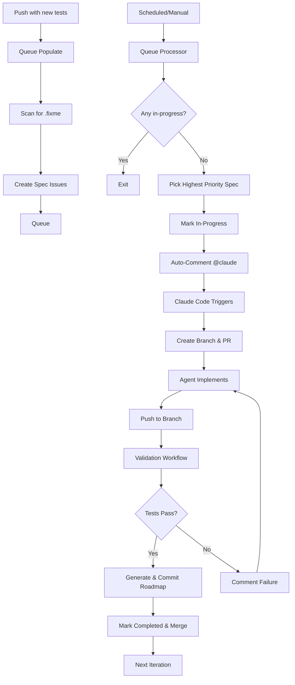

# TDD Automation Queue System Documentation

## Overview

The TDD Automation Queue System is a GitHub Actions-based pipeline that automatically implements code to make failing E2E tests pass. It uses a **queue-based architecture** where specs are processed asynchronously, one at a time, without polling or timeouts.

**Important**: The system **only processes RED tests** marked with `test.fixme()` or `it.fixme()`. Passing tests (GREEN) and skipped tests (`test.skip()`) are automatically excluded from the queue.

## Architecture



> **Priority Order**: APP → MIG → STATIC → API → ADMIN. Within each domain, specs are sorted alphabetically by feature, then by test number (001 before 002, REGRESSION last).

### Hybrid Architecture (Spec-Level vs Codebase-Level)

The TDD automation uses a **hybrid architecture** with two processing paths:

```
┌─────────────────────────────────────────────────────────────────────────────┐
│ SPEC-LEVEL PROCESSING (triggered by @claude comments)                      │
├─────────────────────────────────────────────────────────────────────────────┤
│                                                                             │
│  tdd-dispatch.yml ────(@claude)────┐                                        │
│                                    │                                        │
│  tdd-monitor.yml ─────(@claude)────┼──▶ tdd-execute.yml                     │
│    (stuck retry)                   │      ├─ execute-e2e-fixer ($5, 60min)  │
│    (failed PR recovery)            │      ├─ finalize-fixer (workflow)      │
│                                    │      ├─ execute-refactor-auditor ◀── CONDITIONAL (src/ modified) │
│                                    │      ├─ finalize-auditor (workflow)    │
│                                    │      └─ verify-success (creates PR)    │
│                                                                             │
└─────────────────────────────────────────────────────────────────────────────┘

┌─────────────────────────────────────────────────────────────────────────────┐
│ CODEBASE-LEVEL PROCESSING (standalone scheduled workflow)                  │
├─────────────────────────────────────────────────────────────────────────────┤
│                                                                             │
│  tdd-refactor.yml (daily 1:30 AM UTC)                                       │
│      └─ codebase-refactor-auditor ($10, 120min)                             │
│          ├─ Full codebase audit (not per-spec)                              │
│          ├─ Creates refactor/daily-YYYYMMDD branch                          │
│          └─ Auto-merge enabled                                              │
│                                                                             │
└─────────────────────────────────────────────────────────────────────────────┘
```

**Key Design Decisions**:

| Aspect | Spec-Level (tdd-execute) | Codebase-Level (tdd-refactor) |
|--------|--------------------------|-------------------------------|
| **Scope** | Single spec implementation | Full codebase audit |
| **Trigger** | @claude comment | Scheduled (daily) |
| **Budget** | $5 per agent | $10 total |
| **Refactoring** | Conditional (if src/ modified) | Always runs |
| **When to use** | Implementing failing tests | Proactive maintenance |

## Components

### 1. Queue Manager (`scripts/tdd-automation/queue-manager.ts`)

Core CLI tool for managing the queue:

```bash
# Scan for fixme specs and display results
bun run scripts/tdd-automation/queue-manager.ts scan

# Create issues for all fixme specs (skip duplicates)
bun run scripts/tdd-automation/queue-manager.ts populate

# Get next spec from queue (for workflows)
bun run scripts/tdd-automation/queue-manager.ts next

# Display queue status
bun run scripts/tdd-automation/queue-manager.ts status
```

**Features**:

- Extracts spec IDs from test titles (e.g., `APP-VERSION-001`)
- Checks for duplicate issues before creating
- Integrates with GitHub CLI (`gh`)
- Supports queue state management (queued, in-progress, completed, failed)

### 2. Workflows

#### **tdd-scan.yml** (Scan & Queue RED Tests)

**Triggers**:

- Push to main (when new tests are added)
- Schedule (every 15 minutes)
- Manual dispatch

**Purpose**: Scans for RED tests with `test.fixme()` patterns and creates spec issues

**Important Filtering**:

- ✅ **Includes**: Tests with `test.fixme()` or `it.fixme()` (RED tests needing implementation)
- ❌ **Excludes**: Passing tests without `.fixme()` (GREEN tests already working)
- ❌ **Excludes**: Skipped tests with `test.skip()` (intentionally skipped)

**Key Steps**:

1. Scan for RED tests with `.fixme()` only
2. Check if specs need queueing
3. Create issues (skip duplicates)
4. Display queue status

#### **tdd-dispatch.yml** (Pick & Process)

**Triggers** (Phase 3 Event-Driven Architecture):

- `workflow_run`: Triggered immediately when scan, execute, or monitor workflows complete
- Schedule: Hourly backup (safety net if event triggers miss)
- Manual dispatch

**Purpose**: Picks the next spec from the queue and prepares it for implementation

**Key Steps**:

1. Check if any spec is in-progress
2. If none, pick **highest priority** queued spec (see Priority Order above)
3. Mark issue as in-progress
4. Post @claude comment with complete workflow instructions
5. Exit (no waiting - **Claude Code creates branch and PR later**)

**Note**: The queue processor **does NOT create any branches**. Claude Code automatically creates branches with pattern `claude/issue-{ISSUE_NUMBER}-{timestamp}` when it starts working.

**Concurrency**: Strict serial - only one spec can be in-progress at a time

#### **tdd-execute.yml** (Claude Code Implementation)

**Triggers**:

- issue_comment event when @claude mentioned (posted by queue processor every 15 min)
- Manual @claude mentions by project owner
- Manual workflow_dispatch for specific issues

**Purpose**: Automatically implements specs using split-job architecture with workflow-managed finalization

**Architecture (Split Jobs)**:

```
execute-e2e-fixer ($5, 60 min max)
    └─ e2e-test-fixer agent only
           │
finalize-fixer (workflow step)
    ├─ checkout branch
    ├─ bun run license
    ├─ amend commit if needed
    ├─ detect src/ changes
    └─ push
           │
execute-refactor-auditor ($5, 30 min max) ─── CONDITIONAL: only if src/ modified
    └─ codebase-refactor-auditor only
           │
finalize-auditor (workflow step)
    ├─ bun run license
    └─ amend & push
           │
verify-success
    └─ create PR
```

**Job Details**:

1. **execute-e2e-fixer** (Claude Code - $5 budget, 60 min timeout):
   - Creates branch automatically with pattern `claude/issue-{ISSUE_NUMBER}-{timestamp}`
   - Runs e2e-test-fixer agent ONLY
   - Removes `.fixme()`, implements minimal code
   - Commits changes (does NOT push or run license)

2. **finalize-fixer** (Workflow - 5 min timeout):
   - Checkouts the branch created by execute-e2e-fixer
   - Runs `bun run license` to add copyright headers
   - Amends commit if license added changes
   - Detects if any `src/` files were modified
   - Pushes to remote
   - Outputs `src_modified` for conditional job triggering

3. **execute-refactor-auditor** (Claude Code - $5 budget, 30 min timeout):
   - **CONDITIONAL**: Only runs if `src_modified == 'true'`
   - Runs codebase-refactor-auditor agent ONLY
   - Reviews architecture compliance, refactors if needed
   - Commits changes (does NOT push or run license)
   - **SKIPPED for test-only changes** (saves ~$5 and ~30 min)

4. **finalize-auditor** (Workflow - 5 min timeout):
   - Only runs if execute-refactor-auditor succeeded
   - Runs `bun run license`, amends commit if needed
   - Pushes to remote

5. **verify-success** (5 min timeout):
   - Runs when finalize-fixer OR finalize-auditor succeeds
   - Creates PR to main with `tdd-automation` label
   - Includes `Closes #<issue_number>` in PR body

**Benefits of Split Architecture**:

| Aspect                  | Before (Single Job) | After (Split Jobs)    |
| ----------------------- | ------------------- | --------------------- |
| **Cost (test-only)**    | ~$8-10              | ~$3-5 (skip auditor)  |
| **License reliability** | Agent can forget    | Workflow guarantees   |
| **Commit format**       | Agent can vary      | Workflow standardizes |
| **Failure isolation**   | Single point        | Per-phase visibility  |

**Retry Logic**:

- Max 3 attempts per spec
- Automatic error analysis and fixing
- Pipeline continues even if spec fails (doesn't block queue)

#### **test.yml** (PR Validation & Issue Closure)

**Triggers**:

- Pull request events (opened, synchronize, reopened, closed)
- Push to main branch

**Purpose**: Validates PRs and closes TDD issues when PRs merge

**Key Steps**:

1. **test job** (skip if PR closed):
   - Lint code (`bun run lint`)
   - Type check (`bun run typecheck`)
   - Run unit tests (`bun test:unit`)
   - Run E2E regression tests with sharding (`bun test:e2e:regression`)
   - **JSON reporter** for reliable failure path extraction (v2.4.0)

2. **close-tdd-issue job** (only on PR merge):
   - Triggers when PR with `tdd-automation` label merges
   - Extracts issue number from PR body using `Closes #<number>` pattern
   - Closes issue with reason "completed"
   - Adds label `tdd-spec:completed`
   - Removes label `tdd-spec:in-progress`
   - **Cleans up retry labels** (`retry:spec:1/2/3`, `retry:infra:1/2/3`) on success
   - **Cleans up failure labels** (`failure:spec`, `failure:regression`, `failure:infra`) on success
   - **Note**: PR body MUST include `Closes #<issue_number>` for automatic closure

3. **verify-issue-closed job** (safeguard after PR merge):
   - Runs after `close-tdd-issue` completes (even if it fails)
   - Verifies issue is actually closed and has correct labels
   - **Critical safeguard**: Force-closes issue if closure failed
   - **Prevents queue blocking**: Without this, failed closures block the entire pipeline (like issue #1317)
   - Ensures `tdd-spec:in-progress` is removed and `tdd-spec:completed` is added
   - Returns error if force-close fails (alerts for manual intervention)

4. **delete-tdd-branch job** (cleanup unmerged branches):
   - Triggers when PR is closed **without merging** for `tdd/*` or `claude/*` branches
   - Automatically deletes the branch to prevent stale branches
   - Complements GitHub's auto-delete setting (which only handles merged PRs)
   - **Note**: Merged PR branches are auto-deleted by GitHub repository setting

5. **e2e-results job** (regression classification):
   - Aggregates results from all E2E shards
   - **Infrastructure error detection** (v2.5.3): Detects environment issues BEFORE classifying as regressions
     - Detected errors: `playwright_browser_missing`, `network_error`, `docker_error`, `resource_exhaustion`, `permission_error`, `browser_context_closed`, `test_timeout`
     - Infrastructure errors get `failure:infra` label (on both PR and linked issue)
     - Prevents false regression classifications for flaky/environment issues
   - **JSON-based failure parsing** (v2.4.0): Uses Playwright JSON reporter for reliable spec path extraction
   - Classifies failures as: `target_only`, `regression_only`, `mixed`, or `infrastructure`
   - Applies appropriate failure labels (`failure:spec`, `failure:regression`, `failure:infra`)
   - **Fallback**: Directory-based parsing if JSON unavailable (less reliable for hyphenated paths)

6. **handle-regressions job** (regression analysis - immediate trigger):
   - Triggers when regressions detected in TDD PRs
   - Posts `@claude` comment with regression fix instructions using PAT token (immediate Claude Code trigger)
   - Provides regression spec list, target spec context, and step-by-step fix instructions
   - Includes cooldown check (30 min) to prevent duplicate triggers with `tdd-monitor.yml`
   - **NOTE**: Uses `GH_PAT_WORKFLOW` secret for @claude mention to trigger Claude Code

#### **tdd-monitor.yml** (Monitoring & Recovery)

**Triggers**:

- `workflow_run` on Claude Code TDD completion (event-driven)
- Push to main branch
- Schedule (every 30 minutes as backup)
- Manual dispatch

**Purpose**: Consolidated monitoring workflow that handles health monitoring, stuck spec recovery, PR monitoring, and conflict resolution

**Jobs**:

1. **🏥 Health Check & Circuit Breaker**
   - Monitors failure rate of recent tdd-execute.yml runs
   - Counts specs in retry state (retry:infra:N, retry:spec:N labels)
   - Opens circuit (disables queue) if >50% failure rate or >5 retries
   - Auto-closes circuit when health recovers

2. **🔄 Stuck Spec Recovery**
   - Scans for specs `in-progress` > 90 minutes with no updates
   - Re-queues stuck specs or marks as failed if max retries exceeded
   - Preserves retry count labels
   - **Result**: Prevents permanent pipeline blocks from stuck specs

3. **📋 PR Monitoring**
   - Detects PRs missing auto-merge enablement
   - Updates outdated PR branches (triggers @claude to merge main)
   - Detects stuck PRs (>120 min with failures)
   - **Result**: Prevents pipeline blocking when auto-merge not enabled

4. **🔀 Conflict Resolution**
   - Detects PRs with merge conflicts (CONFLICTING/DIRTY state)
   - Triggers @claude to rebase and resolve conflicts
   - Marks for manual review after one failed attempt
   - **Result**: Automatically resolves conflicts to prevent stale PRs

5. **🔧 Failed PR Recovery**
   - Scans for TDD PRs with failed CI checks (Test\* checks with FAILURE conclusion)
   - Skips PRs already marked `needs-manual-resolution`
   - Checks cooldown period (30 min) to avoid duplicate fix attempts
   - Coordinates with test.yml's handle-regressions job (checks for both comment patterns)
   - Posts `@claude` comment with regression fix instructions
   - Max 3 attempts per PR (counted by "Failed PR Recovery" comments)
   - After 3 failures: adds `needs-manual-resolution` label, marks linked issue as `tdd-spec:failed`
   - **Result**: Automatically recovers PRs stuck with failed CI instead of timing out

6. **📈 Update Spec State** (on push to main only)
   - Runs `analyze:specs` to update SPEC-PROGRESS.md
   - Commits changes automatically

7. **🗑️ Branch Cleanup** (weekly on Sundays only)
   - Scans for all `tdd/*` and `claude/*` branches
   - Deletes branches with closed/merged PRs
   - Deletes orphaned branches (>7 days old, no PR)
   - Keeps branches with open PRs or recent activity
   - **Result**: Safety net cleanup for stale branches

8. **📊 Summary**
   - Generates summary of all monitoring actions

**Why Consolidated Monitoring**:

- Consolidates 8 monitoring functions into one workflow
- Event-driven triggers for immediate response
- Reduces workflow execution overhead
- Consistent health monitoring across all functions

### 3. Configuration

All configuration is hardcoded in workflow files (no central config file):

**Key Settings**:

- **Processing interval**: Event-driven with hourly backup (`.github/workflows/tdd-dispatch.yml`)
- **Max concurrent**: 1 spec at a time - strict serial (hardcoded in processor logic)
- **Issue labels**: `tdd-spec:queued`, `tdd-spec:in-progress`, `tdd-spec:completed`, `tdd-spec:failed`
- **Auto-validation**: Enabled (`.github/workflows/test.yml`)
- **Auto-merge**: Enabled with squash merge (hardcoded in `tdd-execute.yml` prompt)
- **Max retries**: 3 attempts (hardcoded in `tdd-execute.yml` prompt)

**Timeout Configuration** (in `tdd-monitor.yml`):

| Environment Variable          | Value | Purpose                                                                             |
| ----------------------------- | ----- | ----------------------------------------------------------------------------------- |
| `STUCK_TIMEOUT_MINUTES`       | 105   | Specs stuck in-progress >105 min are recovered (15 min buffer above Claude timeout) |
| `PR_STUCK_TIMEOUT_MINUTES`    | 120   | PRs stuck >120 min with failures are force-closed                                   |
| `RETRY_STUCK_TIMEOUT_MINUTES` | 30    | Retries stuck >30 min are recovered                                                 |
| `FAILED_PR_COOLDOWN_MINUTES`  | 30    | Minimum wait between regression fix attempts                                        |

### 4. Required Secrets

The TDD workflows require the following GitHub secrets to be configured:

| Secret Name               | Required Scopes    | Purpose                                         |
| ------------------------- | ------------------ | ----------------------------------------------- |
| `CLAUDE_CODE_OAUTH_TOKEN` | Anthropic OAuth    | Authenticates Claude Code with Anthropic API    |
| `GH_PAT_WORKFLOW`         | `repo`, `workflow` | GitHub Personal Access Token for git operations |

**Why `workflow` scope is required**:

GitHub has a security restriction that prevents **any** git push to repositories containing `.github/workflows/` files unless the token has the `workflow` scope. This applies even when the commit doesn't modify workflow files (see [GitHub documentation](https://docs.github.com/en/actions/security-guides/automatic-token-authentication#permissions-for-the-github_token)).

**Without the `workflow` scope**, Claude Code will fail with:

```
refusing to allow a GitHub App to create or update workflow '.github/workflows/test.yml' without 'workflows' permission
```

**Creating the PAT** (Personal Access Token):

1. Go to GitHub Settings > Developer Settings > Personal Access Tokens > Fine-grained tokens
2. Create a new token with:
   - Repository access: This repository only
   - Permissions:
     - Contents: Read and write
     - Issues: Read and write
     - Pull requests: Read and write
     - Actions: Read
     - **Workflows: Read and write** (CRITICAL for git push)
3. Add the token as a repository secret named `GH_PAT_WORKFLOW`

**Note**: The `GH_PAT_WORKFLOW` token is used by:

- `tdd-dispatch.yml`: Posting @claude comments (triggers Claude Code)
- `tdd-execute.yml`: Git push operations (pushing branches)
- `tdd-refactor.yml`: Git push operations (refactor branches)
- `tdd-monitor.yml`: Issue and PR management operations

## How It Works

### Step 1: Queue Population

When you push new tests with `.fixme()`:

1. **Workflow triggers**: `tdd-scan.yml`
2. **Scan**: `queue-manager.ts scan` finds all specs with `.fixme()`
3. **Create issues**: One minimal issue per spec ID (e.g., `APP-VERSION-001`)
4. **Skip duplicates**: Checks if issue already exists
5. **Label**: `tdd-spec:queued` + `tdd-automation`

**Issue Format**:

```markdown
## 🤖 APP-VERSION-001: should display version badge...

**File**: `specs/app/version/version.spec.ts:28`
**Feature**: app/version/version

### For Claude Code

@claude Please implement this spec:

1. Remove `.fixme()` from test APP-VERSION-001
2. Implement minimal code to pass test
3. Commit: `fix: implement APP-VERSION-001`

Validation runs automatically on push.

**Note**: Branch is created automatically by Claude Code with pattern `claude/issue-{ISSUE_NUMBER}-{timestamp}`.
```

### Step 2: Queue Processing

Every 15 minutes (or manual):

1. **Workflow triggers**: `tdd-dispatch.yml`
2. **Check in-progress**: Query issues with `tdd-spec:in-progress` label
3. **If any exist**: Exit (strict serial - one at a time)
4. **If none**: Pick **highest priority** issue with `tdd-spec:queued` label (priority: APP → MIG → STATIC → API → ADMIN, then alphabetically)
5. **Validate issue state** (⚠️ NEW - Duplicate Prevention):
   - Check if issue is still open (not closed)
   - Check for existing open PRs for this issue
   - If already closed or has open PR: Skip and post explanation comment
   - **Result**: Prevents duplicate PRs for same issue (like PR #1545 incident)
6. **Mark in-progress**: Change label to `tdd-spec:in-progress`
7. **Auto-invoke Claude**: Post comment with `@claude` mention and implementation instructions
8. **Exit**: No waiting, queue processor is done (branch and PR created by Claude Code next)

### Step 3: Automated Implementation (Claude Code)

**Fully automated** - triggered by `@claude` mention in auto-comment:

1. **Claude Code workflow triggers**: `tdd-execute.yml` detects `@claude` mention via issue_comment event
2. **Branch created automatically**: Claude Code creates branch with pattern `claude/issue-{ISSUE_NUMBER}-{timestamp}` (e.g., `claude/issue-1319-20251102-2026`)
3. **Run @agent-e2e-test-fixer**:
   - Read test file with spec ID
   - Remove `.fixme()` from specific test
   - Implement minimal code following architecture patterns
4. **Run @agent-codebase-refactor-auditor** (ALWAYS):
   - Review implementation quality
   - Check for code duplication
   - Ensure architectural compliance
   - Refactor and optimize as needed
5. **Commit changes**:
   - Run `bun run license` (add copyright headers)
   - Commit: `fix: implement APP-VERSION-001`
   - Push to branch
6. **ALWAYS create PR**: To main with `tdd-automation` label and **include `Closes #<issue_number>` in PR body** - REQUIRED in all cases (even if only `.fixme()` removal)
7. **PR verification**: Workflow verifies PR was created within 2 minutes
8. **On PR verification failure**: Mark issue `tdd-spec:failed`, exit (pipeline continues)
9. **Monitor validation**: Watch test.yml CI checks (retry up to 3 times)
10. **On success**: Enable PR auto-merge
11. **On 3 failures**: Mark issue `tdd-spec:failed`, exit

**Pipeline Mode Behavior**:

- Non-interactive (no questions to user)
- Automatic decision-making following Sovrium patterns
- Minimal implementation (just enough to pass test)
- Uses Effect.ts for side effects, proper type safety

### Step 4: PR Validation & Retry

**After PR creation**, Claude Code monitors test.yml validation:

1. **Workflow triggers**: `test.yml` on pull_request events
2. **Run validations**:
   - Lint: `bun run lint`
   - Type check: `bun run typecheck`
   - Unit tests: `bun test:unit`
   - E2E regression: `bun test:e2e:regression`
3. **Claude monitors CI status**: Checks test.yml results via GitHub API
4. **On validation failure** (retry up to 3 times):
   - Claude analyzes error logs
   - Identifies root cause
   - Fixes code
   - Commits and pushes
   - Adds retry label (`retry:spec:1/2/3` for code errors, `retry:infra:1/2/3` for infrastructure errors)
   - Waits for next test.yml run
5. **On 3rd failure**:
   - Updates issue labels: remove `tdd-spec:in-progress`, add `tdd-spec:failed`
   - Comments on issue with failure summary
   - Exits (allows pipeline to continue with next spec)
6. **On success**:
   - Enables PR auto-merge: `gh pr merge --auto --squash`
   - Exits

**Result**: Failed specs (after 3 attempts) are marked but don't block the queue.

### Step 5: PR Merge & Issue Closure

**When PR merges to main**:

1. **test.yml close-tdd-issue job triggers**
2. **Extracts issue number** from PR body using `Closes #<number>` pattern
3. **Closes issue** with reason "completed"
4. **Updates labels**:
   - Adds: `tdd-spec:completed`
   - Removes: `tdd-spec:in-progress`

**Important**: PR body MUST include `Closes #<issue_number>` for automatic closure (workflow provides this to Claude Code automatically).

**Result**: Issues only close when code actually merges to main.

### Step 6: Timeout Recovery

**Recovery workflow runs every 30 minutes**:

1. **Scan for stuck specs**: Find specs `in-progress` with no updates > 105 minutes
2. **Automatic re-queue**: Reset stuck specs to `queued` state (preserve retry count)
3. **Post recovery comment**: Notify about timeout and re-queue
4. **Queue continues**: Stuck specs don't permanently block the pipeline

### Step 7: Completion & Queue Progression

When validation passes and PR merges:

1. **Auto-merge enabled**: PR automatically merges to main (squash merge)
2. **Issue auto-closes**: test.yml workflow closes issue on PR merge
3. **Labels updated**: `tdd-spec:completed` added
4. **Queue progresses**: Processor picks next spec on next run (15 min)

**Timeline**: From queue → implementation → PR → merge typically 10-30 minutes per spec (depending on complexity and retry attempts)

## Labels & States

| Label                                             | State        | Description                                      |
| ------------------------------------------------- | ------------ | ------------------------------------------------ |
| `tdd-spec:queued`                                 | Queued       | Spec waiting to be processed                     |
| `tdd-spec:in-progress`                            | In Progress  | Spec being implemented (branch created)          |
| `tdd-spec:completed`                              | Completed    | Spec passed validation (issue closed)            |
| `tdd-spec:failed`                                 | Failed       | Spec failed after 3 retries (needs human review) |
| `skip-automated`                                  | Skipped      | Human marked as too complex (queue skips it)     |
| `retry:spec:1`, `retry:spec:2`, `retry:spec:3`    | Retry Count  | Tracks code/logic retry attempts (max 3)         |
| `retry:infra:1`, `retry:infra:2`, `retry:infra:3` | Retry Count  | Tracks infrastructure retry attempts (max 3)     |
| `failure:spec`                                    | Failure Type | Target spec itself failing                       |
| `failure:regression`                              | Failure Type | Changes broke OTHER tests                        |
| `failure:infra`                                   | Failure Type | Infrastructure/flaky issue                       |
| `high-failure-rate`                               | Alerting     | Many specs failing (incident)                    |
| `tdd-automation`                                  | (always)     | All TDD automation issues                        |

## CLI Commands

```bash
# Queue Management
bun run scripts/tdd-automation/queue-manager.ts scan       # Scan for fixme specs
bun run scripts/tdd-automation/queue-manager.ts populate   # Create issues
bun run scripts/tdd-automation/queue-manager.ts next       # Get next spec
bun run scripts/tdd-automation/queue-manager.ts status     # Show queue status

# Manual Workflow Triggers
gh workflow run tdd-scan.yml                     # Populate queue
gh workflow run tdd-dispatch.yml                    # Process next spec

# View Queue (GitHub CLI)
gh issue list --label "tdd-spec:queued"                    # Show queued specs
gh issue list --label "tdd-spec:in-progress"               # Show in-progress specs
gh issue list --label "tdd-spec:completed" --state closed  # Show completed specs
```

## Monitoring

Use `queue-manager.ts status` to view current queue status:

```bash
bun run scripts/tdd-automation/queue-manager.ts status
```

This shows:

- Number of queued specs
- Number of in-progress specs
- Top queued specs with priority levels

## Best Practices

### For Manual Triggering

```bash
# Populate queue with all specs
gh workflow run tdd-scan.yml

# Wait 1 minute, then process first spec
sleep 60
gh workflow run tdd-dispatch.yml

# Check queue status
bun run scripts/tdd-automation/queue-manager.ts status
```

### For Claude Code (Automated)

**The system is fully automated** - Claude Code agents are invoked automatically via `@claude` mentions in issue comments.

**How automation works**:

1. **Queue processor creates issue**: New spec issue with `tdd-spec:queued` label
2. **Auto-comment posted**: Issue receives comment with `@claude` mention and implementation instructions
3. **Claude Code workflow triggers**: Detects `@claude` mention, starts agent
4. **Agent operates in pipeline mode**: Creates branch automatically with pattern `claude/issue-{ISSUE_NUMBER}-{timestamp}`
5. **Agent implements test**: Removes `.fixme()`, writes minimal code, commits, pushes
6. **Validation runs**: Automatic validation on push
7. **Auto-merge enabled**: Claude Code runs `gh pr merge --auto --squash` after validation passes
8. **PR merges automatically**: When all checks pass, issue auto-closes

**Manual intervention** (only if automation fails):

If the automated system fails or needs human review:

1. **Check the issue comments**: Look for error messages from validation
2. **Manual invocation**: Reply to issue with `@claude - Please implement spec {SPEC-ID} following the instructions above`
3. **Manual implementation**: Find the Claude-created branch (`claude/issue-{ISSUE_NUMBER}-*`) or create a new one and implement manually

**Pipeline Mode Rules** (for agents):

- ✅ **DO**: Remove `.fixme()` from single spec only
- ✅ **DO**: Implement minimal code to pass test
- ✅ **DO**: Follow domain/application/infrastructure architecture
- ✅ **DO**: Use Effect.ts for side effects
- ✅ **DO**: Run `bun run license` before committing
- ✅ **DO**: Commit with format: `fix: implement {SPEC-ID}`
- ❌ **DO NOT**: Modify multiple specs at once
- ❌ **DO NOT**: Change test logic
- ❌ **DO NOT**: Skip validation steps
- ❌ **DO NOT**: Force push

### For Debugging

```bash
# Check queue status
bun run scripts/tdd-automation/queue-manager.ts status

# View recent workflow runs
gh run list --workflow=tdd-dispatch.yml --limit 5

# View specific spec issue
gh issue view {issue-number}

# Check validation results
gh run list --workflow=tdd-validate.yml --limit 5

# View PR for spec
gh pr list --label "tdd-automation"
```

## Troubleshooting

### No specs being processed

**Check**:

1. Are there any issues with `tdd-spec:queued`?
   ```bash
   gh issue list --label "tdd-spec:queued"
   ```
2. Is there already a spec in-progress?
   ```bash
   gh issue list --label "tdd-spec:in-progress"
   ```
3. Are workflows running?
   ```bash
   gh run list --workflow=tdd-dispatch.yml
   ```

### PR not created (spec marked as failed)

If a spec finishes successfully but no PR is created within 2 minutes:

**What happens automatically**:

1. Workflow marks issue as `tdd-spec:failed`
2. Workflow posts comment explaining PR verification failure
3. Pipeline continues with next spec (doesn't block)

**Manual intervention**:

1. Check if branch exists with changes:
   ```bash
   git fetch origin
   git log origin/claude/issue-{issue-number}-* --oneline
   ```
2. If branch has valid changes, manually create PR:

   ```bash
   gh pr create --base main --head "claude/issue-{issue-number}-{timestamp}" \
     --title "fix: implement {SPEC-ID}" \
     --body "Closes #{issue-number}" \
     --label "tdd-automation"
   ```

   **⚠️ CRITICAL - PR Body Format**:
   - GitHub's auto-close keywords are **format-sensitive**
   - ✅ **Correct**: `Closes #1234` (issue number only, no extra text)
   - ❌ **Wrong**: `Closes #1234 - description here` (extra text breaks auto-close)
   - If multiple issues: Use separate lines
     ```
     Closes #1234
     Closes #5678
     ```

3. If no valid changes, re-queue issue:
   ```bash
   gh issue edit {issue-number} --remove-label "tdd-spec:failed"
   gh issue edit {issue-number} --add-label "tdd-spec:queued"
   ```

**Root causes**:

- Claude Code determined no changes needed (test already passes)
- API rate limit or GitHub connectivity issue
- Branch push failed silently

**Prevention**: Workflow now enforces PR creation in ALL cases (even if only `.fixme()` removal).

### PR stuck open (ready to merge but not merging) ⚠️ NEW

**Most Common Cause**: Claude Code created PR but didn't enable auto-merge

**Automatic Fix** (via `tdd-queue-stuck-pr-monitor.yml`):

- Workflow runs every 10 minutes
- Detects PRs with passing CI and mergeable state but no auto-merge
- Automatically enables auto-merge after 5 minutes
- Posts comment explaining intervention

**Manual Check**:

```bash
# Check if auto-merge is enabled
gh pr view {pr-number} --json autoMergeRequest

# If null, enable it manually
gh pr merge {pr-number} --auto --squash

# Verify it was enabled
gh pr view {pr-number} --json autoMergeRequest
```

**Expected output** (if successful):

```json
{
  "enabledAt": "2025-11-03T...",
  "mergeMethod": "SQUASH"
}
```

**Root Causes**:

- Claude Code workflow incomplete (Step 4B skipped)
- GitHub API rate limit during auto-merge enablement
- PR was in UNKNOWN mergeable state temporarily

**Prevention**: Stuck PR Monitor workflow (runs every 10 min) + strengthened Claude Code instructions

### PR has merge conflicts ⚠️ NEW

**Automatic Resolution** (via `tdd-queue-conflict-resolver.yml`):

- Workflow triggers when main branch updates
- Detects conflicted PRs automatically
- Posts @claude mention with rebase instructions
- Claude Code automatically rebases and resolves conflicts
- One automatic attempt per PR (prevents infinite loops)

**Manual Resolution** (if automatic fails):

```bash
# Fetch latest main
git fetch origin main:main

# Checkout PR branch
git checkout {branch-name}

# Rebase onto main
git rebase origin/main

# Resolve conflicts (if any)
# - Prioritize incoming changes from main
# - Keep both changes in test files if possible

# Force push
git push --force-with-lease

# Verify auto-merge is still enabled
gh pr view {pr-number} --json autoMergeRequest
```

**If labeled `needs-manual-resolution`**:

- Automatic resolution already failed
- Manual intervention required
- Issue removed from queue to unblock pipeline

### Spec stuck in-progress

If a spec has been in-progress for > 90 minutes with no activity:

**Automatic Recovery** (via `tdd-queue-recovery.yml`):

- Runs every 30 minutes
- Re-queues stuck specs automatically
- Preserves retry count labels

**Manual Check**:

1. Check if PR exists and has commits:
   ```bash
   gh pr list --label tdd-automation --state open
   gh pr view {pr-number} --json commits
   ```
2. Check if PR is stuck without auto-merge:
   ```bash
   gh pr view {pr-number} --json autoMergeRequest,mergeable,statusCheckRollup
   ```
3. Check if validation ran:
   ```bash
   gh run list --workflow=test.yml --branch "claude/issue-{ISSUE_NUMBER}-*"
   ```
4. Manually retry or reset:
   ```bash
   # Reset to queued
   gh issue edit {issue-number} --remove-label "tdd-spec:in-progress"
   gh issue edit {issue-number} --add-label "tdd-spec:queued"
   ```

### PR merged but issue still open (CRITICAL) - Missing Auto-Close Keyword

**Issue**: PR merged successfully but issue remains `tdd-spec:in-progress` → **blocks entire queue**

**Root Cause (Issue #5987 Incident)**: Claude Code wrote a detailed PR description instead of the required simple `Closes #<issue_number>` format. GitHub's auto-close feature is **format-sensitive** and fails with extra text.

**Example of what went wrong**:

```markdown
## Summary ← Claude wrote this instead of just "Closes #5987"

Implements support for circular foreign key dependencies...
[30+ lines of implementation details]

🤖 Generated with Claude Code
```

**Automatic Protection** (Since v2.5.1):

1. **PR Body Validation Step**: `tdd-execute.yml` now validates PR body after creation
2. **Auto-Fix**: If `Closes #<issue>` is missing, workflow automatically prepends it
3. **Notification**: Issue receives comment explaining the fix was applied

**Why Claude Does This**: Claude interprets the PR creation command as a _suggestion_ and believes a detailed description would be "more helpful." This is a pattern where AI autonomy conflicts with automation requirements.

**Prevention** (v2.5.1 changes):

- Strengthened prompt in `tdd-dispatch.yml` with explicit "DO NOT" instructions
- Added validation step that auto-fixes missing keywords
- Clear documentation of this failure pattern

### PR merged but issue still open (CRITICAL) - Other Causes

**Issue**: PR merged successfully but issue remains `tdd-spec:in-progress` → **blocks entire queue**

**Automatic Protection** (Since commit 93b5c04):

- `verify-issue-closed` job runs after every PR merge
- Force-closes issue if `close-tdd-issue` fails
- **This prevents queue blocking** (like issue #1317 incident)

**If automatic protection fails**:

1. Check issue state:

   ```bash
   gh issue view {issue-number} --json state,labels
   ```

2. Check if PR was merged:

   ```bash
   gh pr view {pr-number} --json state,mergedAt
   ```

3. If PR merged but issue open, force-close manually:

   ```bash
   gh issue close {issue-number} --reason completed
   gh issue edit {issue-number} --add-label "tdd-spec:completed"
   gh issue edit {issue-number} --remove-label "tdd-spec:in-progress"
   ```

4. Check verify-issue-closed job logs:
   ```bash
   gh run list --workflow=test.yml | grep "merged"
   gh run view {run-id} --log | grep "verify-issue-closed"
   ```

**Root Causes**:

- GitHub auto-close keyword format incorrect (e.g., `Closes #1234 - description`)
- GitHub API rate limit during issue closure
- Network issue during issue update

**Prevention**:

- Always use `Closes #<number>` format (no extra text after number)
- Verify-issue-closed job provides automatic recovery

### Validation failing repeatedly

1. Check validation logs:
   ```bash
   gh run view {run-id} --log
   ```
2. Clone and test locally:
   ```bash
   # Find the Claude-created branch for the issue
   git fetch origin
   git checkout claude/issue-{ISSUE_NUMBER}-{timestamp}
   bun test:e2e {file} --grep "{SPEC-ID}"
   bun test:e2e:regression
   ```
3. Fix and push:
   ```bash
   # Make fixes
   git add -A
   git commit -m "fix: address validation failures for {SPEC-ID}"
   git push
   ```

### Handling `needs-manual-resolution` PRs/Issues

When a PR or issue receives the `needs-manual-resolution` label, it means automatic resolution failed after multiple attempts and human intervention is required.

**Common scenarios that trigger this label**:

| Scenario                 | Cause                                 | Resolution                                     |
| ------------------------ | ------------------------------------- | ---------------------------------------------- |
| **Empty diff**           | PR was superseded by main             | Close PR and issue as "completed"              |
| **Merge conflicts**      | Auto-conflict resolution failed       | Manually resolve and push                      |
| **Max retries exceeded** | 3 fix attempts failed                 | Analyze root cause, fix manually               |
| **Test too complex**     | Spec requires architectural decisions | Add `skip-automated` label, implement manually |

**Step-by-step resolution process**:

1. **Identify the issue type**:

   ```bash
   # Check PR state and diff
   gh pr view {pr-number} --json state,mergeable,body
   gh pr diff {pr-number} | wc -l  # If 0, PR is superseded (empty diff)
   ```

2. **For empty diff PRs** (work already done elsewhere):

   ```bash
   # Close PR as superseded
   gh pr close {pr-number} --comment "Closing: superseded by main (empty diff)"

   # Close linked issue as completed
   gh issue close {issue-number} --reason completed
   gh issue edit {issue-number} --add-label "tdd-spec:completed"
   gh issue edit {issue-number} --remove-label "tdd-spec:in-progress,needs-manual-resolution"
   ```

3. **For merge conflicts**:

   ```bash
   # Checkout and resolve
   git fetch origin
   git checkout {branch-name}
   git rebase origin/main  # or git merge origin/main

   # Resolve conflicts, then push
   git push --force-with-lease

   # Re-enable auto-merge
   gh pr merge {pr-number} --auto --squash
   ```

4. **For max retries exceeded** (test failures):

   ```bash
   # Check what's failing
   gh pr checks {pr-number}

   # Run tests locally
   git checkout {branch-name}
   bun test:e2e:regression

   # Fix the issue, commit, and push
   git commit -m "fix: resolve {SPEC-ID} failures"
   git push
   ```

5. **For too-complex specs**:

   ```bash
   # Mark for manual implementation
   gh issue edit {issue-number} --add-label "skip-automated"
   gh issue edit {issue-number} --remove-label "needs-manual-resolution,tdd-spec:in-progress"
   gh issue edit {issue-number} --add-label "tdd-spec:queued"  # Or implement manually

   # Add explanatory comment
   gh issue comment {issue-number} --body "Marked for manual implementation - spec requires architectural decisions beyond automation scope."
   ```

**After resolution**:

- Remove `needs-manual-resolution` label
- Ensure issue has appropriate state label (`tdd-spec:completed`, `tdd-spec:queued`, or `tdd-spec:failed`)
- The queue will automatically continue with the next spec

**Prevention**: The pipeline now includes automatic detection for:

- **Empty diffs**: PRs superseded by main are auto-closed (`tdd-monitor.yml`)
- **Superseded tests**: Tests already passing in main are detected before processing (`tdd-dispatch.yml`)

### Queue not populating

1. Check if scan finds specs:
   ```bash
   bun run scripts/tdd-automation/queue-manager.ts scan
   ```
2. Check if test files have `.fixme()`:
   ```bash
   grep -r "test.fixme" specs/
   ```
3. Manually populate:
   ```bash
   bun run scripts/tdd-automation/queue-manager.ts populate
   ```

## Safety Features

### Rate Limiting

- **No rate limits**: Queue is stateless, no artificial limits needed
- **Natural throttling**: 15-minute processor interval + strict serial processing

### Validation Gates

- All spec tests must pass
- All regression tests must pass
- All code quality checks must pass (license, lint, typecheck, Effect diagnostics)
- Human review still possible (PRs are created as draft first)

### Error Recovery

- Failed specs are labeled `tdd-spec:failed`
- Issues remain open for manual review
- Automatic retries with retry limit (max 3 attempts)
- Easy to reset: Change label back to `queued`

### Branch Protection

- All changes via PR (never direct to main)
- Auto-merge only after validation passes
- Squash merge (clean commit history)

### Automatic Branch Cleanup

- **Merged PRs**: Branches automatically deleted by GitHub repository setting
- **Closed (unmerged) PRs**: Branches deleted by `delete-tdd-branch` job in test.yml
- **Periodic cleanup**: Weekly safety net removes any missed stale branches
- **Orphaned branches**: Deleted if >7 days old with no associated PR
- **Result**: No manual branch cleanup needed, prevents repository clutter

### Pipeline Blocking Prevention ⚠️ UPDATED (2025-12-17)

Four safeguards prevent the most common causes of pipeline blocking:

#### 1. Stuck PR Monitor (Every 10 minutes)

**Problem Solved**: Claude Code creates PR but forgets to enable auto-merge - PR sits open forever
**Solution**: Automatically enables auto-merge for stuck PRs after 5 minutes
**Impact**: Prevents pipeline blocking (like PRs #1541, #1546 incidents)

#### 2. Conflict Resolver (On main push + every 15 minutes)

**Problem Solved**: PRs become conflicted when main advances - PR stuck in CONFLICTING state
**Solution**: Automatically triggers Claude Code to rebase and resolve conflicts
**Impact**: Prevents stale PRs and pipeline blocking (like PR #1545 incident)

#### 3. Duplicate PR Prevention - Pre-Processing (During queue processing)

**Problem Solved**: Queue processor creates duplicate PRs for already-completed issues
**Solution**: Validates issue state and checks for existing PRs before processing
**Impact**: Prevents duplicate work and conflicting PRs

#### 4. Duplicate PR Prevention - Post-Execution (After Claude completes) ⚠️ NEW

**Problem Solved**: Claude Code runs for 60 minutes, during which another PR is created and merged
**Solution**: After Claude completes, verify issue is still open and no PRs merged before creating PR
**Impact**: Prevents duplicate PRs like PR #6067 (created after PR #6066 already merged)

**How it works**:

1. Claude Code can run for up to 60 minutes
2. During that time, another workflow may process the same issue and merge a PR
3. Before verifying PR creation, workflow checks if issue is still open
4. If issue closed or PR already merged, skips PR verification and cleans up any duplicate PRs
5. Posts explanatory comment on the issue

**Claude Code Instructions** (mandatory pre-PR checks):

```bash
# Before creating PR, Claude MUST run these checks:

# Check 1: Verify issue is still open
ISSUE_STATE=$(gh issue view <ISSUE_NUMBER> --json state --jq '.state')
if [ "$ISSUE_STATE" = "CLOSED" ]; then
  echo "Issue already closed - skipping PR creation"
  exit 0
fi

# Check 2: Check for existing PRs for this issue
EXISTING_PRS=$(gh pr list --label tdd-automation --state all --json number,body,state \
  --jq '.[] | select(.body | contains("Closes #<ISSUE_NUMBER>")) | "#\(.number) (\(.state))"')
if [ -n "$EXISTING_PRS" ]; then
  echo "Found existing PR(s): $EXISTING_PRS - skipping PR creation"
  exit 0
fi
```

**Combined Result**: Pipeline is now self-healing and requires minimal manual intervention

## Claude Code Usage Limits

The TDD pipeline includes usage limit tracking to prevent exhausting the Claude Code subscription mid-week. This ensures sustainable usage that spreads across the week and preserves capacity for manual work.

### How It Works

Before triggering Claude Code for each spec, the pipeline checks the Claude Code OAuth API to verify:

1. **Weekly Limit (90%)**: Maximum 90% of weekly subscription usage, leaving 10% buffer for manual/interactive work
2. **Five-Hour Window (80%)**: Maximum 80% of the five-hour rate limit to prevent burst usage
3. **Daily Spread**: Encourages even distribution of usage across the week (~15% per day)

If any limit is exceeded, the queue pauses processing and waits for usage to reset:

- Five-hour window resets automatically
- Weekly usage resets on a rolling 7-day basis

### Configuration

Usage limits can be customized via environment variables:

| Variable                    | Default | Description                          |
| --------------------------- | ------- | ------------------------------------ |
| `TDD_MAX_DAILY_PERCENT`     | `15`    | Max daily usage as % of weekly limit |
| `TDD_MAX_WEEKLY_PERCENT`    | `90`    | Max weekly usage (leaves buffer)     |
| `TDD_MAX_FIVE_HOUR_PERCENT` | `80`    | Max five-hour window usage           |

### Checking Usage

```bash
# Show detailed usage status
bun run tdd:usage

# Quick check for CI (exits 0=ok, 1=limit exceeded, 2=error)
bun run tdd:usage:check

# JSON output for programmatic use
bun run tdd:usage:json
```

Example output:

```
╔══════════════════════════════════════════════════════════════╗
║                   Claude Code Usage Status                   ║
╠══════════════════════════════════════════════════════════════╣
║  Five-Hour Window:  45.2% used ( 34.8% remaining)            ║
║  Seven-Day Window:  62.3% used ( 27.7% remaining)            ║
║                                                              ║
║  Limits:                                                     ║
║    • Five-hour max:   80%                                    ║
║    • Weekly max:      90% (leaves 10% for manual work)       ║
║    • Daily target:   ~15% per day (spread evenly)            ║
║                                                              ║
║  Status: ✅ CAN PROCEED                                      ║
╚══════════════════════════════════════════════════════════════╝
```

### Required Setup

1. **Generate OAuth Token**: The usage API requires a Claude Code OAuth token
2. **Add to GitHub Secrets**: Create secret `CLAUDE_CODE_OAUTH_TOKEN` with the token value
3. **Workflow uses token**: The `tdd-dispatch.yml` workflow reads this secret automatically

To get your OAuth token (from macOS Keychain):

```bash
security find-generic-password -s "Claude Code-credentials" -w | jq -r '.access_token'
```

### Behavior When Limits Exceeded

- **Queued issues remain queued**: No processing happens, no labels change
- **No comments added by default**: Reduces noise (can be enabled in workflow)
- **Automatic retry**: Queue checks again on next scheduled run (hourly)
- **Fail-open on API errors**: If usage API is unavailable, processing continues

### Usage Tracking Granularity

The Claude Code API provides:

- `five_hour.utilization`: Rolling 5-hour window usage (0-1 scale)
- `seven_day.utilization`: Rolling 7-day window usage (0-1 scale)
- Reset timestamps for both windows

Note: There is no per-run or per-token breakdown, so daily limits are estimated based on weekly usage divided by 7.

## Configuration Options

### Adjust Processing Interval

Edit `.github/workflows/tdd-dispatch.yml`:

```yaml
schedule:
  - cron: '*/15 * * * *' # Every 15 min (current)
  # - cron: '*/30 * * * *'  # Every 30 min (slower)
  # - cron: '*/5 * * * *'   # Every 5 min (faster)
```

### Change Concurrency

Edit `.github/workflows/tdd-dispatch.yml`:

```bash
# Current (line ~70): Check if ANY spec is in-progress
IN_PROGRESS=$(gh issue list --label "tdd-spec:in-progress" --json number --jq 'length')
if [ "$IN_PROGRESS" -gt 0 ]; then exit 0; fi

# To allow 3 concurrent specs:
MAX_CONCURRENT=3
IN_PROGRESS=$(gh issue list --label "tdd-spec:in-progress" --json number --jq 'length')
if [ "$IN_PROGRESS" -ge "$MAX_CONCURRENT" ]; then exit 0; fi
```

### Disable Auto-Merge

Edit `.github/workflows/tdd-validate.yml`:

Remove or comment out the "Enable auto-merge" step.

## Cost Estimation

| Workflow        | Runs/Day           | Duration       | Cost/Day            |
| --------------- | ------------------ | -------------- | ------------------- |
| Queue Populate  | 96 (every 15 min)  | ~1 min         | $0.08               |
| Queue Processor | 96 (every 15 min)  | ~1 min         | $0.08               |
| Validation      | 10-50 (per commit) | ~5 min         | $0.40-$2.00         |
| **Total**       | **~200**           | **~10-50 min** | **$0.56-$2.16/day** |

**Note**: This excludes Claude API costs (variable, depends on implementation complexity)

## Comparison with Old System

| Metric            | Old System           | Queue System          | Improvement           |
| ----------------- | -------------------- | --------------------- | --------------------- |
| Workflow duration | 60+ min (polling)    | 1-5 min (no polling)  | **12x faster**        |
| Granularity       | Per file (~10 specs) | Per spec (1 spec)     | **10x more granular** |
| Concurrency       | Blocked by polling   | Population concurrent | **Scalable**          |
| Failure recovery  | Manual restart       | Automatic retry       | **Resilient**         |
| Cost per run      | High (long runs)     | Low (short runs)      | **10x cheaper**       |
| Visibility        | One issue per file   | One issue per spec    | **More transparent**  |

## Future Enhancements

### Planned

- [ ] Parallel processing (2-3 specs at once)
- [x] Priority queue (high-priority specs first) - **Implemented**: `schema-priority-calculator.ts`
- [x] Automatic retries (up to 3 attempts) - **Implemented**: `retry:spec:1/2/3` labels
- [x] Empty diff detection (superseded PRs) - **Implemented**: `tdd-monitor.yml` v2.3.0
- [x] Superseded test detection (before processing) - **Implemented**: `tdd-dispatch.yml` v2.3.0
- [ ] Slack notifications
- [ ] Cost tracking dashboard

### Experimental

- [ ] AI-powered test prioritization
- [ ] Batch processing (multiple specs in one commit)
- [ ] Cross-repository support
- [ ] Performance benchmarking

## Contributing

When updating the queue system:

1. Test with fixture tests first
2. Run manual dispatch to verify workflows
3. Monitor queue status with `status` command
4. Update this documentation
5. Update CLAUDE.md for Claude Code users

## Support

### Issues with Queue System

1. Check workflow logs: `gh run list --workflow=tdd-queue-*`
2. Check queue status: `bun run scripts/tdd-automation/queue-manager.ts status`
3. Review recent changes to workflows or scripts
4. Open issue in repo with logs and context

### Issues with Specific Spec

1. Check issue comments: `gh issue view {issue-number}`
2. Check PR status: `gh pr view {pr-number}`
3. Check validation logs: `gh run view {run-id}`
4. Test locally: `git checkout claude/issue-{ISSUE-NUMBER}-* && bun test:e2e ...`

---

## Claude Code Workflow Instructions

### Automation Mode - Non-Interactive Operation

When Claude Code receives a `@claude` mention for TDD automation, it operates in **pipeline/automation mode**:

- ✅ Make autonomous decisions following Sovrium architectural patterns
- ✅ Implement minimal code to pass the test
- ✅ Use Effect.ts for side effects in Application/Infrastructure layers
- ❌ DO NOT ask clarifying questions - proceed with best judgment
- ❌ DO NOT wait for user approval - implement and commit

### Success Criteria Checklist

**Task is NOT complete until ALL boxes are checked**:

- [ ] Branch created automatically by Claude Code (pattern: `claude/issue-{ISSUE_NUMBER}-timestamp`)
- [ ] `.fixme()` removed from test `{SPEC_ID}` ONLY (not other tests)
- [ ] Both agents invoked: e2e-test-fixer -> codebase-refactor-auditor
- [ ] Code follows layer-based architecture (Domain/Application/Infrastructure/Presentation)
- [ ] Copyright headers added: `bun run license`
- [ ] Changes committed: `fix: implement {SPEC_ID}`
- [ ] Changes pushed to remote branch
- [ ] **⚠️ PRE-PR CHECK (Step 3B)**: Issue still open AND no existing PRs (prevents duplicates)
- [ ] **⚠️ CRITICAL (Step 4A): Pull Request created** (verify: `gh pr list --label tdd-automation`)
- [ ] PR has correct format (title, body with `Closes #{ISSUE_NUMBER}`, label)
- [ ] **⚠️ CRITICAL (Step 4B): Auto-merge enabled AND verified** (command: `gh pr view $PR_NUMBER --json autoMergeRequest`)
- [ ] Auto-merge verification shows non-null result with `mergeMethod: SQUASH`

### Most Common Failures

1. **Missing PR creation** (issue #1319) -> spec marked failed after 2 min
2. **Missing auto-merge enablement** (PRs #1541, #1546) -> Pipeline blocked for hours
3. **Auto-merge enabled but not VERIFIED** -> May silently fail
4. **Duplicate PR created** (PR #6067) -> PR created after another PR already merged (60 min timeout issue)
5. **Endpoint path confusion** (PR #6564) -> Claude confused Better Auth method name (`setActiveOrganization`) with URL path (`/api/auth/organization/set-active`), changed endpoint to non-existent `/api/auth/organization/set-active-organization`, causing HTTP 404 errors

### Endpoint Path Rules (CRITICAL - Learn from PR #6564)

**NEVER modify API endpoint paths in spec files**. Spec files define the authoritative endpoints.

| Concept         | Example                             | Convention             |
| --------------- | ----------------------------------- | ---------------------- |
| **Method Name** | `setActiveOrganization`             | camelCase (JavaScript) |
| **URL Path**    | `/api/auth/organization/set-active` | kebab-case (HTTP)      |

**These are DIFFERENT**. If spec uses `/api/auth/organization/set-active`, your implementation MUST use that exact path.

**Warning Signs of Endpoint Confusion**:

- Test fails with HTTP 404
- Endpoint URL contains camelCase (e.g., `setActive` instead of `set-active`)
- URL path matches a JavaScript method name exactly

### Implementation Workflow (4 Steps - ALL REQUIRED)

**Note**: Branch is created automatically by Claude Code with pattern `claude/issue-{ISSUE_NUMBER}-{timestamp}`. No manual branch creation needed.

#### Step 1: Invoke e2e-test-fixer Agent

**Use the Task tool** to invoke the **e2e-test-fixer** agent:

- Agent autonomously locates test `{SPEC_ID}` in `{TEST_FILE}`
- Agent removes `.fixme()` from ONE specific test only
- Agent implements minimal code following architecture:
  - **Domain Layer**: Schemas in `src/domain/models/` (Effect Schema)
  - **Application Layer**: Business logic in `src/application/` (Effect.ts workflows)
  - **Infrastructure Layer**: External services in `src/infrastructure/` (Effect.ts)
  - **Presentation Layer**: UI components in `src/presentation/components/` (React)
- Agent runs specific test: `bun test:e2e -- {TEST_FILE} --grep "{SPEC_ID}"`
- Agent runs regression tests: `bun test:e2e:regression`

**Architecture Notes**:

- Use Effect.ts (`Effect.gen`, `pipe`) for side effects in Application/Infrastructure layers
- Keep Domain layer pure (no side effects)
- Follow functional programming patterns (immutability, pure functions)

#### Step 2: Invoke codebase-refactor-auditor Agent (MANDATORY)

**Use the Task tool** to invoke the **codebase-refactor-auditor** agent:

- Agent reviews implementation for code quality
- Agent checks for code duplication
- Agent ensures architectural compliance
- Agent refactors and optimizes as needed
- Agent validates against Sovrium best practices

**IMPORTANT**: This step is MANDATORY even if Step 1 code seems clean.

#### Step 3: Quality Checks & Commit

```bash
bun run license           # Add copyright headers (REQUIRED - fails if missing)
git add -A
git commit -m "fix: implement {SPEC_ID}"
git push -u origin HEAD
```

#### Step 3B: ⚠️ PRE-PR CHECKS (MANDATORY - Prevents Duplicates)

**BEFORE creating a PR**, verify no PR already exists for this issue.
This prevents duplicate PRs when Claude Code runs for 60 minutes and another PR merges first.

```bash
# Check 1: Verify issue is still open (not closed by another merged PR)
ISSUE_STATE=$(gh issue view {ISSUE_NUMBER} --json state --jq '.state')
if [ "$ISSUE_STATE" = "CLOSED" ]; then
  echo "Issue already closed - skipping PR creation"
  exit 0  # Success - work already done
fi

# Check 2: Check for existing PRs (open OR merged) for this issue
EXISTING_PRS=$(gh pr list --label tdd-automation --state all --json number,body,state \
  --jq '.[] | select(.body | contains("Closes #{ISSUE_NUMBER}")) | "#\(.number) (\(.state))"')
if [ -n "$EXISTING_PRS" ]; then
  echo "Found existing PR(s): $EXISTING_PRS - skipping PR creation"
  exit 0  # Success - PR already exists
fi
```

**WHY THIS IS CRITICAL** (PR #6067 incident):

- Claude Code can run for up to 60 minutes
- During that time, another workflow may create and merge a PR for the same issue
- Without this check, Claude creates a duplicate PR after the work is already done
- Duplicate PRs waste CI resources and cause confusion

#### Step 4A: ⚠️ CREATE PULL REQUEST (MANDATORY - NOT OPTIONAL)

**THIS IS THE MOST CRITICAL STEP. THE WORKFLOW FAILS WITHOUT IT.**

```bash
gh pr create \
  --title "fix: implement {SPEC_ID}" \
  --body "Closes #{ISSUE_NUMBER}" \
  --label "tdd-automation"
```

**PR Requirements (ALL REQUIRED)**:

- ✅ Title: Exactly `fix: implement {SPEC_ID}`
- ✅ Body: Exactly `Closes #{ISSUE_NUMBER}` (NO extra text after number - breaks auto-close)
- ✅ Label: `tdd-automation`
- ✅ Required even if only `.fixme()` was removed (no code changes)

**Failure Example**: Issue #1319 - Claude removed `.fixme()`, committed, pushed, but **skipped PR creation** → marked as failed → required manual intervention

**Verify PR was created**:

```bash
gh pr list --label tdd-automation --limit 1 --json number,title | jq '.[0].number'
```

Save the PR number to a variable for Step 4B:

```bash
PR_NUMBER=$(gh pr list --label tdd-automation --limit 1 --json number --jq '.[0].number')
echo "Created PR #$PR_NUMBER"
```

#### Step 4B: ⚠️ ENABLE AUTO-MERGE (EQUALLY CRITICAL - DO NOT SKIP)

**THIS STEP IS REQUIRED IMMEDIATELY AFTER PR CREATION. DO NOT WAIT FOR CI.**

Without auto-merge, the PR will sit open forever and block the entire pipeline.

```bash
# Enable auto-merge IMMEDIATELY (don't wait for CI to finish)
gh pr merge $PR_NUMBER --auto --squash

# VERIFY it was enabled (REQUIRED - must show non-null result)
gh pr view $PR_NUMBER --json autoMergeRequest --jq '.autoMergeRequest'
```

**Expected output** (if successful):

```json
{
  "enabledAt": "2025-11-03T...",
  "enabledBy": {...},
  "mergeMethod": "SQUASH"
}
```

**If output is `null`**, the command FAILED. You MUST retry:

```bash
# Retry up to 3 times if needed
for i in {1..3}; do
  echo "Attempt $i: Enabling auto-merge..."
  if gh pr merge $PR_NUMBER --auto --squash; then
    sleep 2
    RESULT=$(gh pr view $PR_NUMBER --json autoMergeRequest --jq '.autoMergeRequest')
    if [ "$RESULT" != "null" ]; then
      echo "✅ Auto-merge enabled successfully"
      break
    fi
  fi
  sleep 3
done
```

**⚠️ CRITICAL**: Do NOT exit or consider the task complete until auto-merge is verified enabled.

**Failure Examples**:

- Issue #1319: PR created, but auto-merge NOT enabled → Pipeline blocked
- PR #1546: All checks passing, mergeable, but stuck open for 2 hours → Pipeline blocked
- PR #1541: Same issue → Manual intervention required

### CI Monitoring & Failure Handling

After enabling auto-merge in Step 4B, you MUST monitor CI validation:

#### Phase 1: Monitor CI Status

- test.yml CI runs: lint, typecheck, Effect diagnostics, unit tests, E2E regression
- Check status: `gh pr checks $PR_NUMBER`
- Auto-merge is already enabled, so PR will merge automatically when CI passes

#### Phase 2A: If CI Validation PASSES ✅

- PR will auto-merge automatically (no action needed)
- Issue will auto-close via `Closes #{ISSUE_NUMBER}`
- Exit successfully

You can verify the PR merged:

```bash
gh pr view $PR_NUMBER --json state --jq '.state'
# Should show: MERGED
```

#### Phase 2B: If CI Validation FAILS ❌

**Retry loop** (max 3 attempts):

1. Analyze test.yml error logs
2. Fix code issues
3. Add retry label: `gh issue edit {ISSUE_NUMBER} --add-label retry:N` (N=1,2,3)
4. Commit and push fixes
5. Wait for next validation
6. If passes → Enable auto-merge (Phase 2A)
7. If 3rd failure → Mark `tdd-spec:failed` and exit

**After 3 failures**:

```bash
gh issue edit {ISSUE_NUMBER} \
  --remove-label tdd-spec:in-progress \
  --add-label tdd-spec:failed
gh issue comment {ISSUE_NUMBER} \
  --body "❌ Failed after 3 attempts. Manual review required."
```

---

**Last Updated**: 2025-12-18
**Version**: 2.5.4 (Queue System + Immediate Regression Triggering)
**Status**: Active

**Changelog**:

- **2025-12-18 (v2.5.4)**: Immediate regression triggering for faster feedback:
  - **test.yml handle-regressions**: Now posts `@claude` comment with PAT token for immediate Claude Code trigger
  - **Comment format**: Changed from "Regression Analysis (Informational)" to "Regression Auto-Fix Required (Immediate)"
  - **tdd-monitor.yml coordination**: Updated cooldown pattern to match new comment format, now serves as backup safety net
  - **Result**: Regressions trigger Claude Code immediately (vs. waiting up to 30 min for tdd-monitor.yml)
- **2025-12-18 (v2.5.3)**: Improved infrastructure error detection and regression handling:
  - **Infrastructure error detection**: `test.yml` now detects 7 types of infrastructure errors BEFORE classifying as regressions
    - `playwright_browser_missing`, `network_error`, `docker_error`, `resource_exhaustion`, `permission_error`, `browser_context_closed`, `test_timeout`
  - **Consistent label state**: `failure:infra` label now added to both PR AND linked issue (was PR-only)
  - **Regression handler consolidation**: ~~`test.yml` now posts analysis-only comments (no `@claude`)~~ (superseded by v2.5.4 - now posts `@claude` immediately)
  - **Cooldown pattern fix**: `tdd-monitor.yml` cooldown now matches new comment format from `test.yml`
  - **Concurrency debugging**: `tdd-execute.yml` now logs concurrency group status to help diagnose trigger issues
- **2025-12-17 (v2.5.2)**: Fixed race conditions in conflict resolution to fix PR #6073 incident:
  - **Pre-conflict superseded check**: `tdd-monitor.yml` now checks for empty-diff PRs BEFORE attempting conflict resolution
  - **@claude cooldown (10 min)**: Skips posting @claude comments if one was posted in last 10 minutes (prevents duplicate runs)
  - **Escalation wait (15 min)**: Waits 15 minutes before escalating to `needs-manual-resolution` (gives Claude time to finish)
  - **Root cause**: Multiple jobs posted @claude comments in rapid succession, and escalated before Claude could finish
  - **Learning**: Event-driven workflows need coordination primitives (cooldowns, wait times) to prevent race conditions
- **2025-12-17 (v2.5.1)**: Added PR body validation to fix issue #5987 incident (orphaned issues):
  - **Root cause**: Claude Code wrote detailed PR descriptions instead of simple `Closes #<issue>` format
  - **PR body validation step**: `tdd-execute.yml` now validates PR body contains auto-close keyword
  - **Auto-fix capability**: Missing keywords are automatically prepended to PR body
  - **Strengthened prompts**: `tdd-dispatch.yml` now explicitly prohibits custom PR body content
  - **Documentation**: Added troubleshooting section for this failure pattern
  - **Learning**: AI "helpfulness" can conflict with automation requirements - explicit prohibitions needed
- **2025-12-17 (v2.5.0)**: Added post-execution duplicate PR prevention to fix PR #6067 incident:
  - **Post-execution duplicate check**: After Claude completes, verify issue still open and no PRs merged
  - **Pre-PR checks for Claude**: Mandatory checks before creating PR (issue state + existing PRs)
  - **Automatic duplicate cleanup**: Closes any duplicate PRs created during long-running Claude sessions
  - **Documentation updates**: CLAUDE.md and tdd-automation-pipeline.md updated with new safeguards
  - **Root cause**: Claude Code can run up to 60 minutes; another PR may merge during that time
- **2025-12-17 (v2.4.0)**: Improved regression classification reliability:
  - **JSON-based failure parsing**: Uses Playwright JSON reporter (`--reporter=github,json`) for reliable spec path extraction
  - **Fixes hyphenated path issue**: Paths like `admin-enforcement.spec.ts` no longer misparse
  - **Fallback to directory parsing**: Legacy method still available if JSON unavailable
  - **Label cleanup on success**: Retry and failure labels now cleaned up when issue completes
  - **Spec rename handling documented**: Old issues auto-close, new issues created on next scan
- **2025-12-17 (v2.3.0)**: Added superseded detection to prevent wasted effort on already-completed specs:
  - Empty diff detection in `tdd-monitor.yml` (auto-closes PRs with no changes vs main)
  - Superseded test detection in `tdd-dispatch.yml` (checks if `.fixme()` still exists before processing)
  - Comprehensive `needs-manual-resolution` handling documentation
  - Issues and PRs superseded by main are now auto-closed with clear explanations
- **2025-11-03 (v2.1.0)**: Added three self-healing safeguards to prevent pipeline blocking:
  - Stuck PR Monitor workflow (auto-enables auto-merge)
  - Conflict Resolver workflow (auto-resolves merge conflicts)
  - Duplicate PR Prevention (validates issue state before processing)
  - Strengthened Claude Code auto-merge instructions (Step 4B with verification)
- **2025-10-30 (v2.0.0)**: Initial queue system implementation
