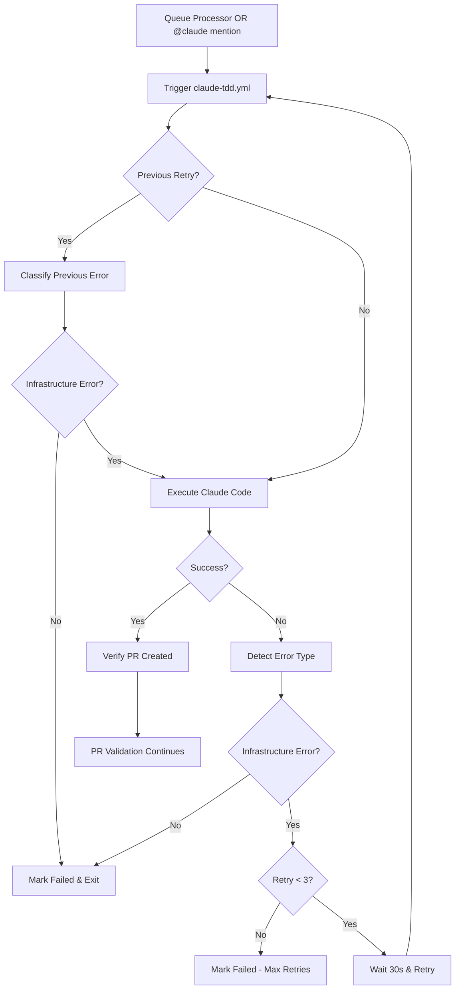

# TDD Automation - Infrastructure Error Handling

## Overview

The TDD automation pipeline includes **infrastructure-level error handling** to distinguish between:

- **Infrastructure/Environment Errors**: Runtime failures in Claude Code, GitHub Actions, or system resources (RETRIABLE)
- **Code/Test Errors**: Implementation bugs, test failures, or validation errors (NOT retriable at infrastructure level)

This system automatically retries infrastructure errors up to 3 times before marking a spec as failed, preventing the pipeline from blocking on transient issues.

## Problem Statement

### Issue #1339 Example: EPERM Error

**What happened**:

```
SystemError: kill() failed: EPERM: Operation not permitted
  at kill (unknown:1:1)
  at Co$ (/$bunfs/root/claude:36:2937)
```

**Root cause**: Claude Code tried to kill a subprocess during cleanup but lacked permission in the GitHub Actions runner environment.

**Current behavior** (before fix):

1. Claude Code crashes without creating PR
2. 2-minute PR verification timer expires
3. Issue marked as `tdd-spec:failed`
4. Queue processor moves to next spec
5. **Manual intervention required**

**Problem**: This is an infrastructure error, not a code error. The spec implementation might have been fine, but the runner environment had a permission issue.

## Error Classification

### Infrastructure Errors (Retriable)

These errors are **NOT caused by code issues** and can be retried automatically:

| Error Type                | Examples                          | Detection Pattern                       |
| ------------------------- | --------------------------------- | --------------------------------------- |
| **Permission Errors**     | EPERM, EACCES                     | `EPERM: Operation not permitted`        |
| **Timeout Errors**        | Claude timeout, workflow timeout  | `timeout\|timed out\|ETIMEDOUT`         |
| **Network Errors**        | Connection reset, DNS failure     | `ECONNRESET\|ENOTFOUND\|socket hang up` |
| **Resource Exhaustion**   | Out of memory, disk full          | `out of memory\|OOM\|ENOSPC`            |
| **Workflow Cancellation** | Manual cancel, concurrency cancel | `cancelled\|canceled`                   |

### Code Errors (NOT Retriable at Infrastructure Level)

These errors are **caused by code issues** and should be handled by Claude Code's retry logic (max 3 attempts):

| Error Type        | Examples                        | Detection Pattern                        |
| ----------------- | ------------------------------- | ---------------------------------------- |
| **Test Failures** | Assertion errors, test timeouts | `Test.*failed\|FAIL\|AssertionError`     |
| **Code Errors**   | Syntax errors, type errors      | `SyntaxError\|TypeError\|ReferenceError` |
| **Lint Errors**   | ESLint violations               | `lint.*error\|ESLint.*error`             |
| **Type Errors**   | TypeScript errors               | `TS[0-9]+:`                              |

## Architecture

### Unified Workflow: `claude-tdd.yml`

This workflow handles ALL Claude Code execution (both automated queue processing and manual @claude mentions) with infrastructure-level retry logic:



### Workflow Components

#### 1. Error Classification Job (`classify-previous-error`)

**Purpose**: Analyze previous run logs to determine if error was infrastructure-related

**Inputs**: Retry attempt number (only runs if > 1)

**Outputs**:

- `is_infrastructure_error`: Boolean
- `error_type`: Classified error type
- `should_retry`: Whether to continue retrying

**Logic**:

```bash
# Get most recent failed run logs
LOGS=$(gh run view "$RECENT_RUN" --log-failed)

# Check for infrastructure error patterns
if echo "$LOGS" | grep -q "EPERM: Operation not permitted"; then
  IS_INFRA_ERROR=true
  ERROR_TYPE="permission_error"
elif echo "$LOGS" | grep -q "ETIMEDOUT|timeout|timed out"; then
  IS_INFRA_ERROR=true
  ERROR_TYPE="timeout"
# ... more patterns ...
fi
```

#### 2. Claude Code Execution Job (`execute-claude`)

**Purpose**: Run Claude Code with timeout monitoring

**Key features**:

- Uses `continue-on-error: true` to capture exit code
- 60-minute timeout (configurable)
- Captures error type immediately after failure
- Updates issue with failure info

**Outputs**:

- `claude_success`: Boolean
- `claude_exit_code`: Exit status
- `error_type`: Detected error type
- `is_infrastructure_error`: Boolean

#### 3. Retry Handler Job (`handle-retry`)

**Purpose**: Decide whether to retry and trigger next attempt

**Conditions**: Only runs if Claude Code failed with infrastructure error

**Logic**:

```bash
NEXT_RETRY=$((CURRENT_RETRY + 1))

if [ "$NEXT_RETRY" -le "$MAX_RETRIES" ]; then
  # Add retry label
  gh issue edit "$ISSUE_NUMBER" --add-label "retry:infra:$CURRENT_RETRY"

  # Wait 30 seconds
  sleep 30

  # Trigger next retry
  gh workflow run claude-tdd.yml \
    --field issue_number="$ISSUE_NUMBER" \
    --field retry_attempt="$NEXT_RETRY"
else
  # Mark as failed
  gh issue edit "$ISSUE_NUMBER" --add-label "tdd-spec:failed" --add-label "failure:infra"
fi
```

#### 4. Success Verification Job (`verify-success`)

**Purpose**: Verify PR was created (same as original workflow)

**Runs**: Only if Claude Code succeeded

**Same behavior as original**:

- Wait up to 2 minutes for PR
- If no PR, mark issue as failed
- Prevents spec from completing without PR

## Integration with Existing System

### Queue Processor Changes

Updated `tdd-queue-processor.yml` to trigger new workflow:

**Before**:

```yaml
# Trigger Claude Code via @claude mention
gh issue comment "$ISSUE_NUMBER" --body "@claude implement this spec..."
```

**After**:

```yaml
# Trigger Claude Code workflow with retry support
gh workflow run claude-tdd.yml \
  --field issue_number="$ISSUE_NUMBER" \
  --field retry_attempt=1

# Still add comment for context (for human readability)
gh issue comment "$ISSUE_NUMBER" --body "@claude implement this spec..."
```

**Note**: Manual @claude mentions also use the same workflow, so they automatically get retry support too!

### Labels Used

| Label                  | Meaning                                        |
| ---------------------- | ---------------------------------------------- |
| `tdd-spec:in-progress` | Spec is currently being processed              |
| `tdd-spec:failed`      | Spec failed after max retries                  |
| `retry:infra:N`        | Infrastructure retry attempt N (1-3)           |
| `retry:spec:N`         | Code retry attempt N (for validation failures) |
| `failure:infra`        | Failed due to infrastructure issue (not code)  |
| `failure:spec`         | Failed due to code/test issues                 |

## Retry Strategy

### Two-Level Retry System

The TDD automation now has **two separate retry mechanisms**:

#### Level 1: Infrastructure Retries (NEW)

- **Max**: 3 attempts
- **Trigger**: Claude Code runtime errors (EPERM, timeouts, etc.)
- **Handler**: `claude-tdd.yml` workflow (recursive trigger)
- **Label**: `retry:infra:N`
- **Wait**: 30 seconds between retries
- **Scope**: Entire workflow re-executes

#### Level 2: Code Retries (Existing)

- **Max**: 3 attempts
- **Trigger**: Test validation failures (test.yml CI)
- **Handler**: Claude Code agent (in-conversation retry)
- **Label**: `retry:spec:N`
- **Wait**: Immediate (Claude analyzes errors and fixes)
- **Scope**: Claude fixes code and pushes update

### Example Flow

**Scenario**: EPERM error on first attempt, then code validation fails twice

```
Attempt 1 (Infra Retry 1):
  ├─ Claude Code starts
  ├─ EPERM error occurs
  └─ Infrastructure retry triggered → Wait 30s

Attempt 2 (Infra Retry 2):
  ├─ Claude Code completes successfully
  ├─ PR created with auto-merge
  ├─ test.yml validation runs
  ├─ Tests fail (code error)
  ├─ Claude analyzes, fixes, pushes (Code Retry 1)
  ├─ test.yml validation runs again
  ├─ Tests fail again
  ├─ Claude analyzes, fixes, pushes (Code Retry 2)
  ├─ test.yml validation runs again
  └─ Tests PASS → PR auto-merges → Issue closes
```

**Total attempts**: 2 infrastructure + 2 code = 4 operations, all automatic

## Monitoring & Debugging

### Check Infrastructure Retry Status

```bash
# List issues with infrastructure retries
gh issue list --label "retry:infra:1"

# View specific issue retry history
gh issue view 1339 --json labels --jq '.labels[].name | select(startswith("retry:infra"))'

# Check workflow run logs
gh run list --workflow="claude-tdd.yml" --limit 10
```

### Identify Infrastructure Errors

```bash
# Find specs that failed due to infrastructure
gh issue list --label "infrastructure-error" --label "tdd-spec:failed"

# View error classification from workflow
gh run view <run_id> --log | grep "Detected:"
```

### Manual Retry

If a spec fails with infrastructure error but you want to retry:

```bash
# Trigger manual retry (attempt 1)
gh workflow run claude-tdd.yml \
  --field issue_number=1339 \
  --field retry_attempt=1

# Or continue from specific attempt
gh workflow run claude-tdd.yml \
  --field issue_number=1339 \
  --field retry_attempt=2
```

## Configuration

### Environment Variables

| Variable                     | Default | Description                                  |
| ---------------------------- | ------- | -------------------------------------------- |
| `MAX_INFRASTRUCTURE_RETRIES` | 3       | Max retry attempts for infrastructure errors |
| `CLAUDE_TIMEOUT_MINUTES`     | 60      | Timeout for Claude Code execution            |

### Timeout Strategy

- **Claude Code**: 60 minutes (hard timeout)
- **Workflow job**: 65 minutes (allows cleanup)
- **Retry wait**: 30 seconds (avoid race conditions)
- **PR verification**: 2 minutes (12 x 10-second polls)

## Best Practices

### For Infrastructure Errors

1. **Don't disable retries**: Infrastructure errors are transient by nature
2. **Monitor retry patterns**: High retry rates may indicate runner issues
3. **Check GitHub Status**: If many specs retry, check https://www.githubstatus.com
4. **Escalate persistent errors**: If specs fail after 3 retries, file issue with GitHub Support

### For Code Errors

1. **Let Claude retry first**: Code errors should be fixed by Claude (up to 3 attempts)
2. **Review after 3 failures**: If validation fails 3x, manually review the code
3. **Check test quality**: Flaky tests may cause false failures
4. **Update specs if needed**: If test is incorrect, update spec and re-queue

## Failure Scenarios

### Scenario 1: EPERM Error (Infrastructure)

**Symptoms**:

- Claude Code crashes with `EPERM: Operation not permitted`
- No PR created
- Branch may or may not exist

**Automatic handling**:

1. Error detected as infrastructure error
2. Wait 30 seconds
3. Retry workflow (up to 3x)
4. If still fails, mark as `tdd-spec:failed` + `infrastructure-error`

**Manual resolution**:

```bash
# Check if branch was created
gh pr list --head "claude/issue-1339-*"

# If branch exists with changes, manually create PR
gh pr create --title "fix: implement APP-THEME-006" --body "Closes #1339" --label "tdd-automation"

# Otherwise, retry workflow
gh workflow run claude-tdd.yml --field issue_number=1339 --field retry_attempt=1
```

### Scenario 2: Timeout (Infrastructure)

**Symptoms**:

- Claude Code exceeds 60-minute timeout
- Workflow cancelled mid-execution

**Automatic handling**:

1. Timeout detected as infrastructure error
2. Retry triggered automatically
3. If timeout persists 3x, marked as failed

**Manual resolution**:

```bash
# Check if spec is too complex
gh issue view 1339 --json body

# Consider manual implementation or breaking into smaller specs
gh issue edit 1339 --add-label "skip-automated" --remove-label "tdd-spec:failed"
```

### Scenario 3: Test Failure (Code Error)

**Symptoms**:

- Claude Code completes successfully
- PR created and auto-merge enabled
- test.yml validation fails

**Automatic handling**:

1. NOT classified as infrastructure error
2. Claude Code's own retry logic handles it
3. Claude analyzes errors, fixes code, pushes update
4. Validation re-runs automatically

**Manual resolution**:

- Usually not needed - Claude handles automatically
- If 3 code retries exhausted, review PR manually

## Metrics & Health

### Key Metrics to Monitor

1. **Infrastructure retry rate**: `infrastructure-retry:*` labels / total attempts
2. **Code retry rate**: `retry:*` labels / total attempts
3. **Infrastructure failure rate**: `infrastructure-error` labels / total attempts
4. **First-attempt success rate**: Specs with no retry labels / total attempts

### Expected Rates (Healthy Pipeline)

- Infrastructure retry rate: < 10%
- Infrastructure failure rate: < 2%
- First-attempt success rate: > 70%

### Alerts

Set up alerts if:

- Infrastructure retry rate > 20% (runner health issues)
- Infrastructure failure rate > 5% (persistent infrastructure problems)
- First-attempt success rate < 50% (consider spec complexity or test quality)

## Rollback Strategy

If the new retry system causes issues:

```bash
# Revert queue processor to use old workflow
git revert <commit-hash>

# Or manually edit tdd-queue-processor.yml
# Change:
#   gh workflow run claude-tdd.yml
# Back to:
#   gh issue comment "$ISSUE_NUMBER" --body "@claude..."
```

**Note**: Old workflow will still work but won't have infrastructure retry logic.

## Future Improvements

1. **Adaptive retry delays**: Exponential backoff (30s, 60s, 120s)
2. **Error pattern learning**: Track common errors and pre-emptive fixes
3. **Runner health checks**: Verify runner health before triggering workflow
4. **Parallel retry pools**: Use separate runner pools for retries
5. **Smart error recovery**: Checkpoint progress and resume from last good state

## Related Documentation

- **TDD Automation Pipeline**: `@docs/development/tdd-automation-pipeline.md`
- **Queue System**: See "Components" section above
- **Recovery Workflow**: `tdd-queue-recovery.yml` (handles stuck specs)
- **GitHub Actions**: `.github/workflows/claude-tdd.yml`
